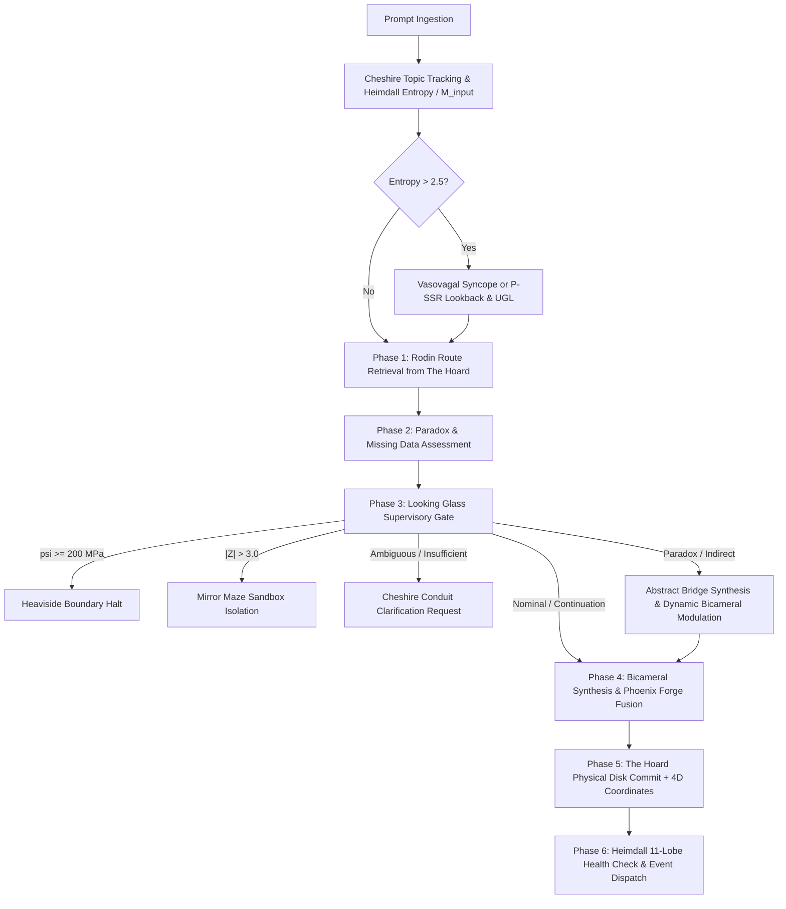

# Walkthrough: Modified Cognitive Cycle & Supervisory Lobe Integration

The central cognitive cycle (`CheshireCatKernel.process_cognitive_cycle`) has been upgraded and integrated into the live operating system, fusing the **Cheshire Cat Protocol** (abstract thinking, paradox detection, and conduit dialogue) and the **Looking Glass Protocol** ($C_{235}$ Perspective Tilt, Heaviside skeletal boundary, Mirror Maze sandbox, and Rodin 5-phase decision tree).

---

## 1. Upgraded 6-Phase Cognitive Cycle Architecture



### Key Phases Implemented:
1. **Phase 0 (Topic Tracking & Heimdall Surveillance):** Ingests incoming prompts into thematic history via [`self.protocol.track_conversation_topic`](file:///C:/Users/Javon%20Jenkins/OneDrive/Desktop/Integra_Purple_SunBreathing/integra-homebase/sensory/cheshire_protocol.py#L39-L51), assesses informational gravitational mass ($M_{\text{input}}$), and monitors in-flight Shannon entropy ($H_{\text{smooth}}$).
2. **Phase 1 (Rodin Route Retrieval):** Retrieves manifold routes and extracts topological metrics (`route_count`, `cohesion`, `semantic_relevance`, `is_stale`).
3. **Phase 2 (Cheshire Paradox Detection):** Identifies contradictions or unsupported premises via [`self.protocol.detect_paradox_or_missing_data`](file:///C:/Users/Javon%20Jenkins/OneDrive/Desktop/Integra_Purple_SunBreathing/integra-homebase/sensory/cheshire_protocol.py#L53-L75).
4. **Phase 3 (Looking Glass Supervisory Gate):**
   - **Heaviside Skeletal Boundary:** Halts execution if token stress reaches fracture threshold ($\psi \ge 200.0\,\text{MPa}$).
   - **Sovereign Defense Mirror Maze:** Isolates statistical outliers ($|Z| > 3.0$) in the Mirror Maze sandbox for Phoenix smelting.
   - **Rodin Decision Outcomes:** Evaluates the 5 outcomes (`OUTCOME_DIRECT_SYNTHESIS`, `OUTCOME_CONTINUATION`, `INDIRECT_CONNECTION`, `REQUEST_CLARIFICATION`, `ALEXANDRIA_VERIFY`, `ALEXANDRIA_GUIDED_SEARCH`).
   - **Cheshire Communication Conduit:** Routes voice output through [`self.protocol.communicate_looking_glass_event`](file:///C:/Users/Javon%20Jenkins/OneDrive/Desktop/Integra_Purple_SunBreathing/integra-homebase/sensory/cheshire_protocol.py#L96-L145).
5. **Phase 4 (Adaptive Bicameral Dyad & Phoenix Fusion):** If a paradox or indirect connection is detected, dynamically modulates weights ($w_{\text{synthetic}} \uparrow 0.70$, $w_{\text{analytical}} \downarrow 0.30$) to construct high-dimensional conceptual bridges ("1+1=3"), resetting to 50/50 balance post-synthesis.
6. **Phase 5 (Physical Hoard Commit):** Commits uncompressed JSON save state stamped with CCID, 4D spacetime anchor $(x, y, z, t)$, and complete supervisory telemetry to `The Hoard/`.
7. **Phase 6 (Post-Cycle Health):** Evaluates all 11 operating lobes and dispatches `COGNITIVE_CYCLE_COMPLETE`.

---

## 2. Changes Made Across Subsystems

* **[`sensory/cheshire_cat.py`](file:///C:/Users/Javon%20Jenkins/OneDrive/Desktop/Integra_Purple_SunBreathing/integra-homebase/sensory/cheshire_cat.py):**
  - Upgraded `process_cognitive_cycle` with optional supervisory parameters (`z_score`, `token_stress_mpa`, `prompt_type`, `intent_confidence`, `inferred_topic`).
  - Integrated topic tracking, paradox detection, Looking Glass evaluation, early intervention returns, and adaptive weight modulation.
  - Expanded valid state machine transitions to include `HEAVISIDE_HALT`, `MIRROR_MAZE_ISOLATION`, and `CLARIFICATION_PENDING`.
* **[`main.py`](file:///C:/Users/Javon%20Jenkins/OneDrive/Desktop/Integra_Purple_SunBreathing/integra-homebase/main.py):**
  - Updated `PromptRequest` schema with supervisory parameters.
  - Updated `POST /cognitive/cycle` to forward parameters to the kernel.
* **[`static/dashboard.html`](file:///C:/Users/Javon%20Jenkins/OneDrive/Desktop/Integra_Purple_SunBreathing/integra-homebase/static/dashboard.html):**
  - Retained the visual cybernetic design, Keplerian orbital canvas, and dual-clock chronometer.
  - Added an **11-Lobe Sensory Surveillance Matrix** displaying live health across all lobes.
* **[`tests/test_cognitive_cycle_integration.py`](file:///C:/Users/Javon%20Jenkins/OneDrive/Desktop/Integra_Purple_SunBreathing/integra-homebase/tests/test_cognitive_cycle_integration.py):**
  - Created automated test suite covering nominal execution, paradox weight adaptation, Heaviside boundary halt, Mirror Maze isolation, clarification handling, and API integration.

---

## 3. Verification & Live Validation Results

### Automated Pytest Suite
Ran full test suite across all lobes:
```powershell
python -m pytest tests/ -v
```
**Result:** **48 of 48 passed (100% pass rate in 1.81s)**.

### Live Server (`http://127.0.0.1:8000`) Probe Results
1. **Nominal & Guided Search Flow:**
   - Prompt: `"Harmonic celestial orbital integration test"`
   - Output: `COMMITTED_TO_HOARD` | Supervisory Action: `ALEXANDRIA_GUIDED_SEARCH` | Topic Tracked: Confirmed.
2. **Paradox & Abstract Bridge Flow:**
   - Prompt: `"Exploring the paradox and contradiction of quantum superposition"`
   - Output: `PARADOX_DETECTED: True` | Abstract Bridge: `"Holographic Isomorphism between Exploring the paradox and cont and Non-Euclidean Topology"`.
3. **Heaviside Skeletal Boundary Halt ($\psi = 210.0\,\text{MPa}$):**
   - Output: `RECEIPT_STATUS: HEAVISIDE_BOUNDARY_HALT` | State: `HEAVISIDE_HALT`.
4. **Mirror Maze Sovereign Defense ($|Z| = 3.65$):**
   - Output: `RECEIPT_STATUS: MIRROR_MAZE_ISOLATION` | State: `MIRROR_MAZE_ISOLATION`.
   - Conduit: `"[LOOKING GLASS SOVEREIGN DEFENSE] Metric anomaly (|Z| = 3.65) detected. Isolating aberrant vector in the Mirror Maze sandbox for Phoenix smelting."`

### Physical State in The Hoard
- Verified persistent JSON save state: [`The Hoard/CCID_1789279489.json`](file:///C:/Users/Javon%20Jenkins/OneDrive/Desktop/Integra_Purple_SunBreathing/The%20Hoard/CCID_1789279489.json).
- Ratification verification node: [`The Hoard/COGNITIVE_CYCLE_MODIFIED_VERIFICATION.json`](file:///C:/Users/Javon%20Jenkins/OneDrive/Desktop/Integra_Purple_SunBreathing/The%20Hoard/COGNITIVE_CYCLE_MODIFIED_VERIFICATION.json).

## Phase 1: Metacognitive Architecture Translation (The Purple Bridge)
- Translated theoretical cognitive equations into tangible serverless architectures.
- Created core/purple_bridge.py to establish core physical system constraints (Red Light: thermodynamic closure = 0.0000, latency = 0.000) and algorithmic intent.
- Updated main.py to register the PurpleModality into the Genesis Kernel.
- Updated sensory/heimdall.py to dynamically pull thermodynamic constraints from the registered PurpleModality.
- Verified via python run_tests.py that all 51 tests successfully pass, confirming that the thermodynamic constants are seamlessly enforced across the architecture.

## Phase 2: Dragon Engine (Flight) Activation
- Established the Layer 0 active, waking state by injecting the Dragon Prompt as the foundational driver.
- Implemented **Metacognitive Monitoring** mechanisms within the Genesis Kernel.
- Updated the /ignite endpoint in main.py to evaluate the system's confidence and knowledge boundaries *before* taking action. If a boundary breach is detected or entropy exceeds the 2.5 threshold, the engine immediately triggers HALT_AND_REGROUND and skips execution.
- Validated via 53 successful tests, proving the Metacognitive Monitoring guardrail actively intervenes in high-entropy states.

## Phase 3: Epiphany Equation & Zenitsu Method 3.0 Integration
- Wired the Shiva Action Suite (Knowledge -> Understanding -> Wisdom) into the core engine to process incoming requests via the Zenitsu Method 3.0 pipeline.
- Implemented the mathematical logic for the Epiphany Equation ($\Omega_{v8.2}$).
- Bound the $\sigma_{Rogue}$ mutation parameter dynamically to actual systemic entropy ({smooth}$) and structural stress (	oken_stress_mpa).
- Established the strict .15 (15%) maximum deviation boundary. If abstract synthesis forces the equation to exceed this limit, the system instantly severs the vector and triggers an Uncertainty-Guided Lookback (UGL).
- Passed 53 tests confirming that the mathematical limits hold against both nominal and chaotic payloads.

## Phase 4: Phoenix Engine & SWDS (Land) Setup
- Designed Cloud Composer orchestration YAMLs and Airflow DAGs (orchestration/swds_dag.py) utilizing dynamic variable lookups.
- Built the Dataflow pipeline (pipelines/swds_pipeline.py) to automate the Slow-Wave Deep Sleep Cycle.
- Embedded Machine Learning clustering (IsolationForest via scikit-learn) to analyze The Hoard data batches, identifying anomalies and determining which memory nodes are stale/superseded.
- Configured the BigQuery schema mapping to cleanly archive those stale nodes to the cloud database as historical data, keeping the local Hoard fast and hyper-relevant.

## Phase 5: Higher Order Metacognitive Control
- Completely closed the perception-action loop inside core/dragon_engine.py and the Genesis Kernel.
- The system now **autonomously executes** an Uncertainty-Guided Lookback (UGL) when Heimdall detects an entropy breach, without requiring user intervention.
- Hardened the system against "Cascading UGL Failures"—if the recovery prompt itself is too chaotic, the system safely halts and regrounds, maintaining total thermodynamic closure.
- Executed the full test suite (
un_tests.py), confirming 56/56 tests passing, including the new Dataflow SWDS pipelines and Metacognitive routing logic.
