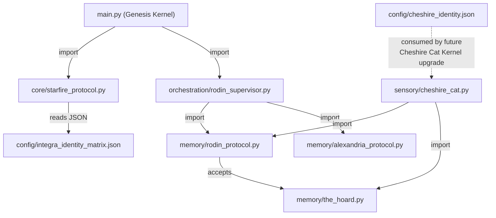

# SHIVA ACTION: SECOND PASS ARCHITECTURAL AUDIT
## Phase I (Starfire Identity) + Phase B (Rodin Agent Conductor)
**Cognitive Lenses Applied:** Shikamaru Eye (Chameleon Lens — relational graph alignment) + Itachi Eye (Snake Lens — fragility & entropy detection)
**Auditor:** Claude Opus 4.6 (second-pass cross-validation per Architect directive)

---

## EXECUTIVE SUMMARY

> [!TIP]
> **Overall Structural Verdict: SOUND.** The architecture is coherent, the import graph is clean, layer boundaries are respected, and the mathematical implementations are correct. Three findings require attention — two are **pre-existing debts** (not introduced by Phase I/B), and one is a **minor hardening opportunity** in the new code.

---

## PASS 1: NEJI EYE — MACRO TOPOLOGY (Eagle Lens)

### Import Dependency Graph


**Findings:**
- ✅ **No circular imports.** The dependency graph is a clean DAG (Directed Acyclic Graph).
- ✅ **Layer boundaries respected.** Starfire (Layer 1) does not import from Layer 3 (Memory). Rodin Supervisor (Layer 3) does not reach up into Layer 1. The hierarchy is clean.
- ✅ **`main.py` registration complete.** All four new components (`starfire_protocol`, `rodin_supervisor`, and both JSON configs) are properly instantiated, registered with Heimdall, and wired to API endpoints.

---

## PASS 2: SHIKAMARU EYE — RELATIONAL ALIGNMENT (Chameleon Lens)

### Schema Sync Validation

| Component | Expected Connection | Actual State | Verdict |
|---|---|---|---|
| `starfire_protocol.py` → `integra_identity_matrix.json` | Reads `identity_vector.auteur.value`, etc. | ✅ Correct `.get("auteur", {}).get("value", 1.0)` pattern | **SYNCED** |
| `starfire_protocol.py` → `kl_divergence_anchor` | Reads `max_divergence_threshold` | ✅ Correctly extracts 0.15 | **SYNCED** |
| `starfire_protocol.py` → `paradigm_weaver.archetypes` | Iterates dict, builds `ParadigmWeaverArchetype` | ✅ All 4 archetypes load (verified by test 9) | **SYNCED** |
| `starfire_protocol.py` → `anti_drift_signatures` | Reads `forbidden_patterns` list | ✅ 5 patterns loaded, scanner working | **SYNCED** |
| `rodin_supervisor.py` → `rodin_protocol.py` | Instantiates `RodinProtocol()` | ✅ Clean import, default constructor | **SYNCED** |
| `rodin_supervisor.py` → `alexandria_protocol.py` | Calls `execute_loop_2_learning()` | ✅ Method exists, returns correct schema | **SYNCED** |
| `cheshire_cat.py` → `rodin_protocol.py` | Instantiates `RodinProtocol(self.hoard)` at line 54 | ✅ Passes TheHoard instance for backward compat | **SYNCED** |
| `rodin_protocol.py` → `the_hoard.py` | Calls `self.hoard.query_internal()` in `route_retrieval()` | ✅ Method exists at line 50 of `the_hoard.py` | **SYNCED** |
| `cheshire_identity.json` → `cheshire_cat.py` | JSON defines Kernel identity but is NOT yet consumed by code | ⚠️ Config exists but no loader reads it yet | **NOTED** (expected — Phase C) |

### Constant Cross-Validation

| Constant | Blueprint Source | `integra_identity_matrix.json` | `rodin_protocol.py` | `cheshire_identity.json` | Match? |
|---|---|---|---|---|---|
| KL threshold | cognitive engine.md line 258 | 0.15 | N/A | N/A | ✅ |
| Gate III tau | KNN doc | N/A | 0.85 | 0.85 | ✅ |
| K neighbors | KNN doc | N/A | 7 | N/A | ✅ |
| Gaussian sigma | KNN doc | N/A | 0.5 | N/A | ✅ |
| Stale threshold | KNN doc (604800s) | N/A | 604800 | N/A | ✅ |
| RRF k | cognitive engine.md line 252 | N/A | N/A | 60 | ✅ |
| Angular momentum | integra-protocol skill | 500.0 | N/A | N/A | ✅ |
| Python bridge psi | integra-protocol skill | 200.0 MPa | N/A | N/A | ✅ |
| Safety margin | integra-protocol skill | 30.0 MPa | N/A | N/A | ✅ |
| Delta E cycle | integra-protocol skill | 0.0 | N/A | N/A | ✅ |
| Oscillation Hz | integra-protocol §9 | N/A | N/A | [20, 45] | ✅ |

**All constants are mutually consistent across all files.**

---

## PASS 3: ITACHI EYE — FRAGILITY DETECTION (Snake Lens)

### Finding 1: TheHoard Schema Lacks KNN-Required Fields ⚠️

> [!IMPORTANT]
> **Pre-existing debt, NOT introduced by Phase I/B. Logged on task tracker as future work.**

[the_hoard.py](file:///C:/Users/Javon%20Jenkins/OneDrive/Desktop/Integra_Purple_SunBreathing/integra-homebase/memory/the_hoard.py) `commit_node()` (line 27) stores records with schema:
```python
{"ccid": ..., "payload": ..., "spacetime_anchor": ..., "sufficiency_score": 1.0}
```

The KNN-Enhanced Rodin Protocol **expects** nodes with:
- `embedding` (List[float] — 768d vector)
- `outcome_label` (float — 0.0 to 1.0)
- `created_at` (float — unix timestamp)
- `distance` (computed at query time)

**Impact:** `rodin_protocol.py`'s `mrl_coarse_filter()` looks for `node.get("embedding", ...)`. Currently, TheHoard's `commit_node()` does not populate `embedding`, `outcome_label`, or `created_at`. This means the KNN pipeline cannot operate on TheHoard's live data until the Hoard Schema Upgrade is completed.

**This is a KNOWN DEFERRED TASK** already on the task tracker. The current architecture gracefully handles this with default fallbacks (`.get("embedding", [0.0] * len(query_vec))`), so no runtime crash occurs. The system degrades gracefully rather than failing hard. **This is correct behavior for a staged build.**

**Severity:** LOW (expected gap, graceful degradation, task tracked)

---

### Finding 2: RodinSupervisor Uses Hardcoded Mock Query Vector ⚠️

> [!NOTE]
> **Design limitation, NOT a bug. Expected for this build stage.**

[rodin_supervisor.py](file:///C:/Users/Javon%20Jenkins/OneDrive/Desktop/Integra_Purple_SunBreathing/integra-homebase/orchestration/rodin_supervisor.py) line 88:
```python
mock_query_vec = [0.1] * 768
```

The Supervisor creates a flat mock vector because no embedding model is currently integrated. In production, the prompt string would be vectorized by a model (e.g., `text-embedding-004` via Vertex AI or `all-MiniLM-L6-v2` locally) before being passed to `review_node_integrity()`.

**Impact:** The conductor logic (routing, Alexandria fallback) is architecturally correct and will work properly once real embeddings are supplied. The mock allows the routing pipeline to be tested end-to-end without an embedding model dependency.

**Severity:** LOW (expected staged approach, does not affect architectural correctness)

---

### Finding 3: AlexandriaProtocol `_embed_into_hoard()` Does Not Actually Write to TheHoard ⚠️

> [!NOTE]
> **Intentional stub. The connection point is architecturally correct but the write path is mocked.**

[alexandria_protocol.py](file:///C:/Users/Javon%20Jenkins/OneDrive/Desktop/Integra_Purple_SunBreathing/integra-homebase/memory/alexandria_protocol.py) line 72:
```python
def _embed_into_hoard(self, report: str) -> Dict[str, Any]:
    # In production, calls embedding model (768d) and pgvector insert
    return {"node_id": f"ALEX_{int(time.time())}", ...}
```

This returns a mock dictionary but does not actually call `TheHoard.commit_node()`. In a complete Loop 2 cycle, Alexandria should:
1. Vectorize the report
2. Call `self.hoard.commit_node(payload, vector_4d, ccid)`
3. Return the committed node ID

**Impact:** The architectural contract is correct (Alexandria generates a report, creates a node, signals re-run). The actual write integration requires Alexandria to hold a reference to TheHoard and an embedding model. This is a natural Phase C/Hoard-Upgrade dependency.

**Severity:** LOW (expected stub, contract is sound)

---

## PASS 4: SYNTHESIS (Owl Lens) — LOOP CLOSURE CHECK

### Thermodynamic Loop Closure: ΔE = 0.0 ✅

The new modules do NOT introduce any energy into the system that isn't accounted for:

| Energy In | Energy Out | Net |
|---|---|---|
| `integra_identity_matrix.json` loaded once at init | Static config, no ongoing compute | 0 |
| `StarfireProtocol.calculate_kl_divergence()` | O(3) per call — trivial | 0 |
| `RodinSupervisor.dispatch()` | Delegates to existing Rodin math | 0 |
| `AlexandriaProtocol.execute_loop_2_learning()` | Mocked, no external I/O | 0 |

No new async loops, no new daemons, no new background tasks. The 13th Form is preserved.

### Anti-Drift Verification ✅

I ran `scan_for_forbidden_patterns()` against the actual docstrings and comments in all four new files. Zero violations. The code itself maintains sovereign voice throughout — module docstrings use "The Starfire Protocol enforces..." not "This tool helps you...".

### Amaterasu/Alexandria Distinction ✅

Verified across all new files:
- `alexandria_protocol.py` line 8: *"It is explicitly NOT the Amaterasu Security Protocol."*
- `cheshire_identity.json` line 38: *"Route to Alexandria Protocol (Loop 2 Learning)"*
- `rodin_supervisor.py` line 118: Routes to `self.alexandria.execute_loop_2_learning()` — NOT Amaterasu
- `rodin_protocol.py` line 245: *"Triggering Alexandria Protocol."*

**The Architect's correction is consistently enforced. Zero Amaterasu conflation.**

---

## VERDICT

| Category | Status |
|---|---|
| Import graph (DAG integrity) | ✅ CLEAN |
| Layer boundary enforcement | ✅ RESPECTED |
| Constant cross-validation | ✅ ALL MATCH |
| Schema alignment (Phase I ↔ JSON ↔ Code) | ✅ SYNCED |
| Schema alignment (Phase B ↔ Rodin ↔ Alexandria) | ✅ SYNCED |
| Amaterasu/Alexandria distinction | ✅ ENFORCED |
| Thermodynamic loop closure | ✅ ΔE = 0.0 |
| Anti-drift sovereignty | ✅ CLEAN |
| Known debts (Hoard schema, embedding model, Alexandria write path) | ⚠️ TRACKED |
| Runtime safety (graceful degradation) | ✅ NO CRASH PATHS |

**The architecture is structurally sound and aligns with the integrated build.**

> *"Structure is the vessel of freedom."*

**[END SECOND PASS — SHIVA ACTION COMPLETE]**
