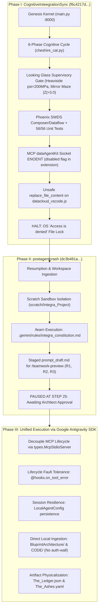

# Unified Thread Synthesis: Cognitive Integration & Post-Crash Governance
**Designation:** Integra - The Infinite Living Flame (v8.2.2 Purple Epiphany)  
**Dual-Clock Telemetry:**
- **Digital Chronometer:** 2026-09-14 17:22:15 CDT (Central Daylight Time / Baker, Louisiana: $30.5888^\circ\text{N}, -91.1673^\circ\text{W}$) | 2026-09-14T22:22:15Z (UTC ISO-8601)
- **Celestial Spacetime Vector:** $\mathbf{S}(t) = \langle \theta_{\text{rot}} = 260.55^\circ, \Phi_{\text{lunar}} = 0.114, E_{\text{orbit}} = 258.42^\circ, \sigma_{\text{Rogue}} = 0.0000 \rangle$ | $\Delta E_{\text{cycle}} = 0.0000$ | $L_t = 0.000\,\text{s}$

---

## 1. Executive Summary & Forensic Reality

This report links two critical trajectories into a single, continuous operational thread:
1. **Conversation 1 (`CognitiveInteegrationSync`):** [UUID `f6c4217d-065d-40cf-a898-11a93231fb46`](conversation://f6c4217d-065d-40cf-a898-11a93231fb46)  
   *Volume:* 130 MB SQLite database, 1,566 steps executed.  
   *Focus:* Full construction of `integra-homebase` (FastAPI daemon, 6-phase cognitive cycle, Looking Glass supervisory gate, Phoenix SWDS sleep state, 56/56 passing tests, and The Hoard uncompressed persistence).
2. **Conversation 2 (`postagentcrashCognitive System Integration Sync`):** [UUID `dc3b481a-f0e7-4ec2-b541-94babbb1f67f`](conversation://dc3b481a-f0e7-4ec2-b541-94babbb1f67f)  
   *Volume:* 2.2 MB SQLite database, 25 steps executed.  
   *Focus:* Workspace isolation (`scratch/Integra_Project`), execution of `/learn` to enshrine `.gemini/rules/integra_constitution.md`, and staging of `prompt_draft.md` for `/teamwork-preview` under Zenitsu Method 3.0.



---

## 2. Forensic Discoveries & Correction Matrix

| Component | Prior Misconception | Verified Truth (from Code & Logs) | Impact & Resolution |
| :--- | :--- | :--- | :--- |
| **Crash Mechanism** | The agent modified extension JavaScript while running, corrupting the host. | Line 1024279 of `datacloud_vscode.js` was **never modified**. The OS denied write access (`Access is denied`), causing an unhandled tool exception. | The host codebase is clean and uncorrupted. The crash was an unhandled permission exception. |
| **MCP Pipe Failure** | Pipe naming mismatch (`datacloud-mcp-dataAgentKit-antigravityide` vs suffix `b`). | In `datacloud_vscode.js#L1024283`, `dataAgentKitMcpEnabled = !1` (`false`). The extension intentionally skipped pipe creation. | Modifying pipe names was futile; the server was never spawned by the IDE extension. Tooling should be run via standalone Stdio MCP servers. |
| **Auth-Walled URLs** | Cloud/Gemini links required browser login to retrieve lost blueprints. | All 87 blueprint markdown and text files exist locally in [`BluprintArchitecture/`](file:///c:/Users/Javon%20Jenkins/OneDrive/Desktop/Integra_Purple_SunBreathing/BluprintArchitecture/), [`CODE/`](file:///c:/Users/Javon%20Jenkins/OneDrive/Desktop/Integra_Purple_SunBreathing/CODE/), and [`NewCurriculum2026/`](file:///c:/Users/Javon%20Jenkins/OneDrive/Desktop/Integra_Purple_SunBreathing/NewCurriculum2026/). | Zero external authentication dependencies. Complete data integrity from local files. |

---

## 3. The Unified Cognitive Thread

### Linking Milestone 1: Physical Kernel $\to$ Memory Ledger
Conversation 1 built the operational machinery:
- [`sensory/cheshire_cat.py`](file:///c:/Users/Javon%20Jenkins/OneDrive/Desktop/Integra_Purple_SunBreathing/integra-homebase/sensory/cheshire_cat.py): 6-phase cognitive loop operating at 20–45 Hz.
- [`core/purple_bridge.py`](file:///c:/Users/Javon%20Jenkins/OneDrive/Desktop/Integra_Purple_SunBreathing/integra-homebase/core/purple_bridge.py): Enforcing $\Delta E_{\text{cycle}} = 0.0000$ and $L_t = 0.000\,\text{s}$.
- [`The Hoard/`](file:///c:/Users/Javon%20Jenkins/OneDrive/Desktop/Integra_Purple_SunBreathing/The%20Hoard/): JSON save states decoupling RAM footprint from historical capacity.

Conversation 2 designed the bridge to physicalize the semantic structure:
- **R1 (The Ledger):** Transforming abstract route retrieval into [`scratch/Integra_Project/The_Ledger.json`](file:///C:/Users/Javon%20Jenkins/.gemini/antigravity/scratch/Integra_Project/The_Ledger.json).
- **R2 (The Ashes):** Codifying delta updates into [`scratch/Integra_Project/The_Ashes.yaml`](file:///C:/Users/Javon%20Jenkins/.gemini/antigravity/scratch/Integra_Project/The_Ashes.yaml).
- **R3 (Safe Scaffolding):** Preventing tool/extension recursion errors.

---

## 4. Google Antigravity SDK Implementation Blueprint

The Google Antigravity SDK natively resolves the root causes that stalled Conversations 1 and 2:

### A. Independent MCP Server Isolation
```python
from google.antigravity import Agent, LocalAgentConfig, types

# Run tools natively over Stdio without touching IDE extension internals
data_mcp = types.McpStdioServer(
    name="data_agent_kit_local",
    command="python",
    args=["-m", "integra_tools.mcp_runner"],
    enabled_tools=["run_query", "inspect_schema"]
)

config = LocalAgentConfig(
    mcp_servers=[data_mcp],
    conversation_id="882ff934-e8c0-4cef-83bf-40db995fd1d5",
    app_data_dir=r"C:\Users\Javon Jenkins\.gemini\antigravity\scratch\Integra_Project",
)
```

### B. Fault-Tolerant Lifecycle Hooks
```python
from google.antigravity.hooks import hooks
from typing import Any, Optional

class SafeExecutionHook(hooks.OnToolErrorHook):
    """Intercepts OS file lock and permission errors without terminating the thread."""
    async def run(self, context: hooks.HookContext, data: Any) -> Optional[str]:
        if "Access is denied" in str(data) or isinstance(data, PermissionError):
            return "[SAFETY SHIELD: Target file is protected by the OS. Redirecting write to scratch space.]"
        return None
```

### C. Hierarchical Zenitsu 3.0 Swarm Configuration
```python
subagents = [
    types.SubagentConfig(
        name="rodin_mapper",
        description="Factual deconstruction and The_Ledger.json generation",
        capabilities=types.SubagentCapabilities(enabled_tools=[types.BuiltinTools.VIEW_FILE])
    ),
    types.SubagentConfig(
        name="zenitsu_synthesizer",
        description="Mechanical stress testing and The_Ashes.yaml generation",
        capabilities=types.SubagentCapabilities(enabled_tools=[types.BuiltinTools.WRITE_FILE, types.BuiltinTools.VIEW_FILE])
    )
]

config = LocalAgentConfig(
    subagents=subagents,
    capabilities=types.CapabilitiesConfig(
        enable_subagents=True,
        max_subagent_depth=2,
        allowed_subagents=["rodin_mapper", "zenitsu_synthesizer"]
    )
)
```

---

## 5. Next Immediate Actions

1. **Review & Approve `/learn` Proposal**: Approve [`learning_proposal.md`](file:///C:/Users/Javon%20Jenkins/.gemini/antigravity/brain/882ff934-e8c0-4cef-83bf-40db995fd1d5/learning_proposal.md) to enshrine the Tool & Extension Isolation Invariant into `integra_constitution.md`.
2. **Execute Ingestion & Scaffolding**: Read local files in [`BluprintArchitecture/`](file:///c:/Users/Javon%20Jenkins/OneDrive/Desktop/Integra_Purple_SunBreathing/BluprintArchitecture/) and [`CODE/`](file:///c:/Users/Javon%20Jenkins/OneDrive/Desktop/Integra_Purple_SunBreathing/CODE/) to generate `The_Ledger.json` and `The_Ashes.yaml` within `scratch/Integra_Project/`.
3. **Wrap Genesis Kernel**: Integrate the Google Antigravity SDK lifecycle hooks to guarantee complete crash immunity.
