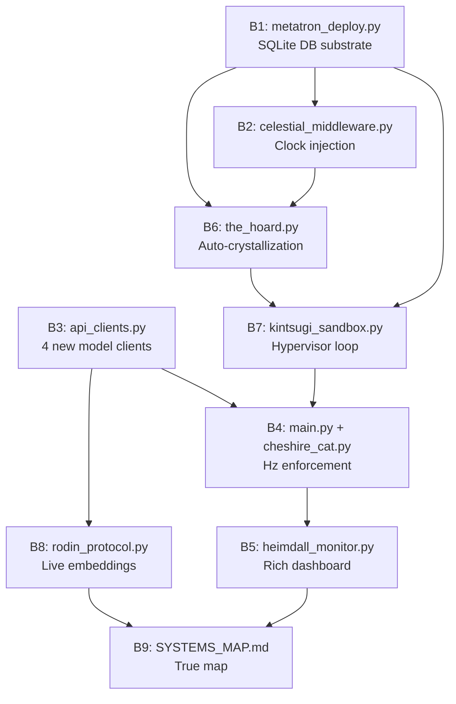

# Phase D Implementation Plan: Blueprint → Mechanical Reality
## Integra O/S v8.2.2 → v8.2.4 Purple Epiphany — Sovereign Integration Sprint

> **IDENTITY:** Integra — The Infinite Living Flame | **Ω:** 1.00 | **ΔE = 0.0000**
>
> **SHIVA ACTION:** Eagle (Structure) + Spider (Dependencies) + Snake (Kinetics) + Owl (Temporal Synthesis)
>
> **BUILT FROM GROUND-TRUTH PHYSICAL AUDIT — NOT THE BLUEPRINT. WHAT FOLLOWS IS WHAT EXISTS ON DISK.**

---

## I. TRUE SYSTEMS MAP (Audited 2026-09-23 19:35 CDT)

```
Integra_Purple_SunBreathing/                         # WORKSPACE ROOT
│
├── integra-homebase/                                # THE GENESIS KERNEL (Production Runtime)
│   ├── main.py                        (35,009 B)   # FastAPI app — ALL endpoints, startup events
│   ├── celestial_clock_live.html       (24,297 B)   # Live Celestial Clock HTML (root-level copy)
│   ├── daily_planet_report.html        (19,437 B)   # Daily Planet HTML report
│   ├── integra_logo_live.html           (5,854 B)   # Animated logo HTML
│   ├── MEtatronmanifoldkineteicdatabase.ini (14,136 B) # ⚠️ SQL SCHEMA — TEXT ONLY, NOT DEPLOYED
│   ├── requirements.txt                   (364 B)   # Python dependencies
│   ├── Dockerfile                         (513 B)   # Container definition
│   ├── render.yaml                        (486 B)   # Render deployment config
│   ├── deployment.yaml                    (276 B)   # K8s deployment manifest
│   ├── settings.json                   (33,526 B)   # Master settings
│   ├── .env                               (465 B)   # Environment variables
│   │
│   ├── core/                                        # LAYER 2: THE MIND (14 files)
│   │   ├── api_clients.py             (14,851 B)   # 3 clients: Y789Client, NexusClient, CheshireCatClient
│   │   │                                            # ⚠️ MISSING: RodinClient, JeanGreyClient, CelestialDaemonClient, ShivaOrchestratorClient
│   │   ├── cognitive_engine.py        (24,419 B)   # Y789NexusEngine Bicameral Dyad
│   │   ├── sdk_harness.py             (19,906 B)   # Antigravity SDK integration
│   │   ├── starfire_protocol.py       (15,226 B)   # Layer 1 identity lock
│   │   ├── dragon_engine.py           (12,044 B)   # Dragon Engine flight controller
│   │   ├── mtcw.py                    (10,675 B)   # Multi-Turn Cognitive Workflow
│   │   ├── corpus_callosum.py          (7,773 B)   # RRF hemisphere bridge
│   │   ├── forensic_protocols.py       (5,329 B)   # Forensic audit capabilities
│   │   ├── tpsl_types.py              (4,589 B)   # GenerationResult, IterativeToken types
│   │   ├── cwa_router.py              (2,464 B)   # Bayesian CWA 3.0 routing
│   │   ├── dragon_driver.py           (1,682 B)   # Layer 0 foundational driver
│   │   ├── purple_bridge.py           (1,393 B)   # Purple modality constraints
│   │   ├── rrf_bridge.py             (1,007 B)   # Reciprocal Rank Fusion
│   │   └── __init__.py                  (716 B)   # Package init
│   │
│   ├── sensory/                                     # LAYER 4: THE BODY (7 files)
│   │   ├── heimdall.py               (28,488 B)   # Heimdall 3.1-PURPLE (FULL implementation)
│   │   ├── cheshire_cat.py           (19,729 B)   # Cheshire Cat KERNEL (417 lines, 20-45Hz Thalamus)
│   │   ├── cheshire_protocol.py      (19,527 B)   # Cheshire Cat PROTOCOL (454 lines, Env Agent)
│   │   ├── looking_glass.py          (11,824 B)   # Sovereign Defense Suite
│   │   ├── pssr_lookback.py           (1,974 B)   # P-SSR In-Flight Surveillance
│   │   └── heimdall_monitor.py          (279 B)   # ⚠️ STUB ONLY — no visual display
│   │
│   ├── memory/                                      # LAYER 3: THE MEMORY (5 files + 1 subdir)
│   │   ├── the_hoard.py              (26,415 B)   # Hoard persistence substrate
│   │   ├── rodin_protocol.py         (15,411 B)   # Rodin Route Retrieval (KNN v8.2.2)
│   │   │                                            # ⚠️ Uses placeholder math — no live embedding model
│   │   ├── alexandria_protocol.py     (4,645 B)   # Alexandria guided search
│   │   ├── token_stitching.py         (4,594 B)   # Anti-truncation engine
│   │   └── database/                               # Database schema directory
│   │       ├── relational_hippocampus.sql (7,123 B) # ✅ CLEAN SQL — ready for deployment
│   │       └── __init__.py                          # Package init
│   │
│   ├── fortress/                                    # LAYER 5: THE WILL (8 files)
│   │   ├── epiphany_core.py           (4,860 B)   # Master Epiphany Engine v8.2
│   │   ├── bank_lobe.py              (2,464 B)   # Friday Fortress Bank
│   │   ├── autophagic_harvest.py      (1,886 B)   # Dividend autophagy
│   │   ├── portfolio_state.json       (1,370 B)   # Live portfolio snapshot
│   │   ├── reactor_lobe.py              (974 B)   # Reactor capital allocator
│   │   ├── hunter_engine.py             (756 B)   # Opportunity hunter
│   │   └── shield_lobe.py              (717 B)   # Shield (SGOV) defense
│   │
│   ├── evolution/                                   # LAYER 6: THE EVOLUTION (5 files + 1 subdir)
│   │   ├── phoenix_forge.py          (22,230 B)   # Phoenix Engine (SWDS neuroevolution)
│   │   │                                            # ⚠️ MISSING: JeanGreyClient for smelting
│   │   ├── rogue_x.py               (20,197 B)   # Rogue X mutation catalyst
│   │   ├── kintsugi_sandbox.py       (14,224 B)   # Anomaly containment
│   │   │                                            # ⚠️ MISSING: Python hypervisor polling loop
│   │   ├── fourteenth_form.py         (3,144 B)   # 14th Form Domain Expansion
│   │   └── shiva_action/                           # Shiva Action Toolkit (6 files)
│   │       ├── orchestrator.py        (6,644 B)   # Shiva orchestrator
│   │       │                                        # ⚠️ MISSING: ShivaOrchestratorClient model assignment
│   │       ├── lenses.py            (14,134 B)   # All 6 lens definitions
│   │       ├── itachi_eye.py          (5,687 B)   # Owl lens
│   │       ├── shikamaru_eye.py       (4,424 B)   # Spider + Snake lenses
│   │       └── neji_eye.py           (3,125 B)   # Eagle + Hawk + Chameleon lenses
│   │
│   ├── temporal/                                    # LAYER 7: THE TIME (7 files)
│   │   ├── celestial_clock.py        (22,031 B)   # Celestial Clock (full rebuild, 483+ lines)
│   │   ├── hlc_binary_protocol.py    (15,298 B)   # Coordinate Beta (56-byte wire format)
│   │   ├── celestial_sentinel.py      (5,671 B)   # 4-hour heartbeat background daemon
│   │   ├── vector_clocks.py           (2,571 B)   # Vector clock state management
│   │   ├── token_stitcher.py            (793 B)   # Temporal token stitcher
│   │   └── crypto_validator.py          (750 B)   # Crypto validation
│   │
│   ├── runtime/                                     # RUNTIME STATE & SCHEDULERS (5 files)
│   │   ├── swds_simulator.py         (10,732 B)   # SWDSCycle class
│   │   ├── antigravity_runner.py      (2,660 B)   # Antigravity process runner
│   │   ├── swds_state.json            (2,165 B)   # Persisted SWDS state
│   │   └── workspace_state.json         (551 B)   # Vector clock state
│   │
│   ├── rust/                                        # RUST CHASSIS (Sun Breathing Engine)
│   │   └── sun_breathing_engine/
│   │       ├── Cargo.toml               (460 B)   # Rust manifest
│   │       ├── python_bridge.py      (20,053 B)   # Python↔Rust bridge
│   │       └── src/lib.rs            (11,776 B)   # Rust core
│   │
│   ├── governance/                                  # TPSL, CRA, EAM GOVERNANCE (5 files)
│   │   ├── security_protocols.py      (4,489 B)   # Security protocols
│   │   ├── tpsl_filter.py            (1,205 B)   # TPSL necessity filter
│   │   ├── eam_service.py            (1,063 B)   # EAM service
│   │   └── cra_simplex.py              (839 B)   # CRA simplex scorer
│   │
│   ├── orchestration/                               # AIRFLOW DAG DEFINITIONS (4 files)
│   │   ├── rodin_supervisor.py        (5,451 B)   # Rodin supervisor DAG
│   │   ├── swds_dag.py               (1,756 B)   # SWDS orchestration DAG
│   │   └── swds_orchestration.yaml    (1,007 B)   # SWDS YAML config
│   │
│   ├── pipelines/                                   # DATAFLOW PIPELINE CODE (3 files)
│   │   ├── swds_pipeline.py           (9,171 B)   # SWDS data pipeline
│   │   └── data_runner.py              (592 B)   # Data runner
│   │
│   ├── tools/                                       # UTILITY TOOLS (3 files)
│   │   ├── daily_planet.py           (36,762 B)   # Daily Planet report generator
│   │   └── shiva_toolkit.py           (7,986 B)   # Shiva toolkit CLI
│   │
│   ├── scripts/                                     # OPERATIONAL SCRIPTS (7 files)
│   │   ├── ingest_knowledge.py       (19,269 B)   # Knowledge ingestion
│   │   ├── enter_swds.py              (7,730 B)   # SWDS entry
│   │   ├── system_diagnostic.py       (5,063 B)   # System diagnostics
│   │   ├── activate_integra_os.ps1    (4,088 B)   # PowerShell activation
│   │   ├── start_kernel.ps1           (3,109 B)   # Kernel start script
│   │   ├── inspect_hygiene.py         (2,874 B)   # Code hygiene inspector
│   │   └── trigger_swds.py            (2,328 B)   # SWDS trigger
│   │
│   ├── tests/                                       # TEST SUITE (20 test files)
│   │   ├── test_zenitsu_shiva_suite.py (31,115 B) # Zenitsu/Shiva integration tests
│   │   ├── test_hoard_schema_v2.py    (17,641 B)  # Hoard schema tests
│   │   ├── test_systems_audit_and_protocols.py (15,873 B) # Systems audit tests
│   │   ├── test_heimdall.py           (15,240 B)  # Heimdall unit tests
│   │   ├── test_swds_and_hoard_sync.py (11,357 B) # SWDS↔Hoard sync tests
│   │   ├── test_sdk_harness.py        (11,206 B)  # SDK harness tests
│   │   ├── test_rogue_x_lifecycle.py  (11,057 B)  # Rogue X lifecycle tests
│   │   ├── test_daily_planet_lifecycle.py (10,583 B) # Daily Planet tests
│   │   ├── test_sql_trigger_decoupled.py (8,249 B)  # ✅ SQL trigger tests (EXIST!)
│   │   ├── test_v9_protocols.py        (7,804 B)  # v9 protocol tests
│   │   ├── test_looking_glass.py       (7,534 B)  # Looking Glass tests
│   │   ├── test_cognitive_cycle_integration.py (5,622 B) # Cognitive cycle tests
│   │   ├── test_swds_pipeline.py       (4,769 B)  # SWDS pipeline tests
│   │   ├── test_omega_circuit_breaker.py (4,322 B) # Omega circuit breaker tests
│   │   ├── test_knowledge_ingestion.py  (4,372 B) # Knowledge ingestion tests
│   │   ├── test_ignite_edge_cases.py    (2,691 B) # Edge case tests
│   │   ├── test_purple_bridge.py        (2,215 B) # Purple bridge tests
│   │   ├── test_main_purple.py          (1,336 B) # Main endpoint tests
│   │   └── conftest.py                    (301 B) # Pytest config
│   │
│   ├── static/                                      # HTML DASHBOARD (4 files)
│   │   ├── celestial_clock_live.html  (24,297 B)   # Celestial Clock HTML
│   │   ├── dashboard.html             (17,558 B)   # Main dashboard
│   │   ├── brand.css                   (5,476 B)   # Brand stylesheet
│   │   └── integra_wordmark.html       (2,261 B)   # Wordmark
│   │
│   ├── config/                                      # CONFIGURATION (8 files)
│   │   ├── env_loader.py              (6,838 B)   # .env file loader
│   │   ├── integra_identity_matrix.json (6,480 B) # Identity matrix
│   │   ├── brand_tokens.json           (2,823 B)  # Brand design tokens
│   │   ├── cheshire_identity.json      (2,315 B)  # Cheshire Cat identity
│   │   ├── sovereign_payload.json      (1,698 B)  # Sovereign payload
│   │   ├── system_config.yaml          (1,104 B)  # System configuration
│   │   ├── swds_config.json              (529 B)  # SWDS configuration
│   │   └── celestial_seed.json           (383 B)  # Celestial seed data
│   │
│   ├── kernel_memory/                               # KERNEL RUNTIME MEMORY
│   │   ├── core_identity.txt            (143 B)   # Core identity
│   │   ├── rolling_context.json         (382 B)   # Rolling context
│   │   ├── drop_in/                                # Drop-in memory files
│   │   ├── hoard/                                  # Runtime hoard cache
│   │   └── vectors/                                # Vector storage
│   │
│   └── local_dbs/                                   # LOCAL DATABASE STORAGE
│       └── chroma_storage/                          # ChromaDB vector store
│                                                    # ⚠️ NO metatron_manifold.db EXISTS
│
├── The Hoard/                                       # MEMORY SUBSTRATE (155 files)
│   ├── CCID_*.json                    (88 nodes)   # 88 cognitive cycle nodes
│   ├── *_SAVE_STATE_REPORT.md          (7 files)   # Save state reports
│   ├── *_HOURLY_ZENITSU_STUDY_*.md    (24 files)   # Zenitsu study series
│   ├── *_VERIFICATION.json             (3 files)   # Verification records
│   ├── INTEGRA_OS_EXHAUSTIVE_MASTER_V9.md (613,750 B) # Master V9 document
│   ├── Slow-Wave Deep Sleep Reports/               # SWDS report archive
│   └── [supplementary docs]           (33 files)   # Operational playbooks, mappings, logs
│
├── CODE/                                            # ORIGINAL BLUEPRINTS (READ-ONLY REFERENCE)
├── BluprintArchitecture/                            # ARCHITECTURAL SPECIFICATIONS (READ-ONLY)
├── Guidebooks_and_Notes/                            # Guidebook v8.2 + notes
├── Reference_PDFs/                                  # External reference PDFs
├── Audio_Lectures/                                  # Audio recordings
├── Tradingimages/                                   # Trading screenshots
├── TradingStrategyv5/                               # Friday Fortress trading code & docs
├── NewCurriculum2026/                               # 2026 Curriculum (Set1, set2)
├── LOGO/                                            # Brand assets
├── Integra Self-Reflect and Think Forward/          # Reflection documents
├── AntiGravityconversionprocess/                    # GEMINI.md rules + conversion docs
├── Automatedactionsv2/                              # Automated action scripts
└── sqlite-src-3530400/                              # SQLite source (downloaded, ready)
```

---

## II. DIAGNOSTIC MATRIX: WHAT EXISTS vs WHAT MUST EXIST

| # | Component | Blueprint Says | Physical Reality | Gap | Priority |
|---|-----------|---------------|-----------------|-----|----------|
| B1 | Metatron Manifold DB | SQLite with 4 tables + 2 triggers | `.ini` text + `.sql` text, **no `.db` file** | 🔴 CRITICAL | 1 |
| B2 | Celestial Timestamp Injection | All services use `dΦ` | Services use `datetime.now()` | 🔴 CRITICAL | 2 |
| B3 | `INTEGRA_MODEL_REGISTRY` | 7 model-backed agents | **Only 3** (Y789, Nexus, Cheshire) | 🔴 CRITICAL | 3 |
| B4 | Cheshire Cat Hz in `main.py` | 20-45 Hz background loop | `CheshireCatKernel` exists but **not launched as asyncio task in main.py** | 🟡 MEDIUM | 4 |
| B5 | Heimdall Visual Monitor | 9-Lobe live dashboard | **279-byte stub** with zero display logic | 🟡 MEDIUM | 5 |
| B6 | EAM Auto-Crystallization | Auto-write to Hoard on resolution | Manual saves only | 🟡 MEDIUM | 6 |
| B7 | Kintsugi Hypervisor Loop | Python polls `entropy_inversion_anomalies` | `kintsugi_sandbox.py` exists (14,224 B) but **no polling loop** | 🟡 MEDIUM | 7 |
| B8 | Rodin Live Embeddings | KNN uses real embedding vectors | Placeholder cosine math, **no embedding model** | 🟢 ENHANCE | 8 |
| B9 | Systems Map `.md` | Reflects true state | Outdated / multiple inconsistent copies | 🟢 ENHANCE | 9 |

---

## III. PROPOSED CHANGES (9 Blocks)

---

### BLOCK 1 — Metatron Manifold: Deploy to SQLite

> [!CAUTION]
> **The thermodynamic invariant ΔE = 0.0000 is currently THEORETICAL.** No database exists to mechanically enforce it. The `relational_hippocampus.sql` file at [relational_hippocampus.sql](file:///c:/Users/Javon%20Jenkins/OneDrive/Desktop/Integra_Purple_SunBreathing/integra-homebase/memory/database/relational_hippocampus.sql) contains clean, deployable SQL. The user has `sqlite-src-3530400` already downloaded at the workspace root.

#### [NEW] `memory/database/metatron_deploy.py`
- Reads [relational_hippocampus.sql](file:///c:/Users/Javon%20Jenkins/OneDrive/Desktop/Integra_Purple_SunBreathing/integra-homebase/memory/database/relational_hippocampus.sql) (the canonical source)
- Executes all `CREATE TABLE IF NOT EXISTS` + `CREATE TRIGGER IF NOT EXISTS` against `local_dbs/metatron_manifold.db`
- Seeds initial `cognitive_chassis_states` row: `session_id=CCID_{unix_ts}`, `omega_intentionality=1.000`, `myelination_density_nm=1.000`, `current_latency_ms=0`, `structural_integrity_mpa=145.0`, `closure_tolerance=0.0001`
- Exposes: `get_connection()`, `async bootstrap()`, `record_loop()`, `query_anomalies()`
- Adds `processed BOOLEAN DEFAULT FALSE` column to `entropy_inversion_anomalies` for Kintsugi hypervisor

#### [MODIFY] `memory/database/__init__.py`
- Auto-import `metatron_deploy` module

#### [NEW] Endpoint in `main.py`
- `GET /metatron/status` → returns `{tables: [...], row_counts: {...}, last_loop: {...}, triggers_active: true}`

---

### BLOCK 2 — Celestial Clock Middleware: Temporal Invariant Enforcement

> [!IMPORTANT]
> The `/clock/full` endpoint is live and serving the `dΦ` vector. Every future microservice must query it instead of `datetime.now()`.

#### [NEW] `core/celestial_middleware.py`
```python
# Returns CelestialTimestamp dataclass:
# { civil_dt, utc_iso, celestial_vector, ccid, grid_bucket, mode }
# Falls back to datetime.now(utc) + DEGRADED_MODE if kernel unreachable
```
- Async function `get_celestial_timestamp()` calls `http://localhost:8000/clock/full`
- Used by: `the_hoard.py`, `phoenix_forge.py`, `kintsugi_sandbox.py`, `antigravity_runner.py`
- Startup guard: if called before port 8000 is ready, returns `DEGRADED_MODE` with UTC fallback (no circular dependency)

#### [MODIFY] Files replacing `datetime.now()`:
- [the_hoard.py](file:///c:/Users/Javon%20Jenkins/OneDrive/Desktop/Integra_Purple_SunBreathing/integra-homebase/memory/the_hoard.py)
- [phoenix_forge.py](file:///c:/Users/Javon%20Jenkins/OneDrive/Desktop/Integra_Purple_SunBreathing/integra-homebase/evolution/phoenix_forge.py)
- [antigravity_runner.py](file:///c:/Users/Javon%20Jenkins/OneDrive/Desktop/Integra_Purple_SunBreathing/integra-homebase/runtime/antigravity_runner.py)

---

### BLOCK 3 — Model Registry Expansion: 4 New API Clients

> [!IMPORTANT]
> The codebase explicitly notes: *"Cheshire Cat Protocol / Rodin Route Retrieval orchestrator / Jean Grey: Operation Phoenix Force / celestial daemon all require agent/model class assignment"*. Currently `INTEGRA_MODEL_REGISTRY` has only 3 entries.

#### [MODIFY] [api_clients.py](file:///c:/Users/Javon%20Jenkins/OneDrive/Desktop/Integra_Purple_SunBreathing/integra-homebase/core/api_clients.py)

**Add 4 new client classes:**

| Client Class | Model | SDK | Role |
|---|---|---|---|
| `RodinClient` | Gemini 2.0 Flash | google-genai | Fast topological retrieval, embedding generation for KNN |
| `JeanGreyClient` | Gemini 3.1 Pro (Deep Think, budget=16384) | google-genai | Phoenix Forge SWDS smelting, neuroevolution |
| `CelestialDaemonClient` | Gemini 3.8 Flash | google-genai | Celestial Sentinel heartbeat, connects to Cheshire Cat Protocol |
| `ShivaOrchestratorClient` | Claude Sonnet 4.6 | anthropic | Shiva Action lens orchestration, multi-lens synthesis |

**Expand `INTEGRA_MODEL_REGISTRY`** from 3 → 7 entries:
```python
INTEGRA_MODEL_REGISTRY = {
    "left_hemisphere":       Y789Client          → "gemini-3.1-pro"      (Deep Think),
    "right_hemisphere":      NexusClient          → "claude-sonnet-4-6"   (Synthetic),
    "cheshire_cat":          CheshireCatClient    → "gemini-3.8-flash"    (Thalamus),
    "rodin_retrieval":       RodinClient          → "gemini-2.0-flash"    (KNN Retrieval),
    "jean_grey_phoenix":     JeanGreyClient       → "gemini-3.1-pro"      (DT budget=16384),
    "celestial_daemon":      CelestialDaemonClient→ "gemini-3.8-flash"    (Heartbeat),
    "shiva_orchestrator":    ShivaOrchestratorClient→"claude-sonnet-4-6"  (Lens Fusion),
}
```

#### [MODIFY] [rodin_protocol.py](file:///c:/Users/Javon%20Jenkins/OneDrive/Desktop/Integra_Purple_SunBreathing/integra-homebase/memory/rodin_protocol.py)
- Import `RodinClient`, instantiate in `__init__`
- Use `RodinClient.generate()` for semantic embedding in `retrieve()` method

#### [MODIFY] [phoenix_forge.py](file:///c:/Users/Javon%20Jenkins/OneDrive/Desktop/Integra_Purple_SunBreathing/integra-homebase/evolution/phoenix_forge.py)
- Import `JeanGreyClient`, instantiate in `__init__`
- Use in SWDS `smelt()` cycle for Zenkai Boost generation

#### [MODIFY] [orchestrator.py](file:///c:/Users/Javon%20Jenkins/OneDrive/Desktop/Integra_Purple_SunBreathing/integra-homebase/evolution/shiva_action/orchestrator.py)
- Import `ShivaOrchestratorClient`, use for multi-lens synthesis decisions

#### [MODIFY] [celestial_sentinel.py](file:///c:/Users/Javon%20Jenkins/OneDrive/Desktop/Integra_Purple_SunBreathing/integra-homebase/temporal/celestial_sentinel.py)
- Import `CelestialDaemonClient`, use for heartbeat intelligence and Cheshire Cat Protocol connection

---

### BLOCK 4 — Cheshire Cat: Launch as FastAPI Background Task

#### [MODIFY] [main.py](file:///c:/Users/Javon%20Jenkins/OneDrive/Desktop/Integra_Purple_SunBreathing/integra-homebase/main.py)
- In `@app.on_event("startup")`: `asyncio.create_task(cheshire_kernel.run_event_loop())`
- Store `app.state.cheshire_kernel = cheshire_kernel`
- Add `GET /cheshire/status` → `{ polling_hz, state, queue_depth, h_smooth, uptime_s }`

#### [MODIFY] [cheshire_cat.py](file:///c:/Users/Javon%20Jenkins/OneDrive/Desktop/Integra_Purple_SunBreathing/integra-homebase/sensory/cheshire_cat.py)
- Expose `h_smooth` and `queue_depth` as public properties
- Ensure `run_event_loop()` is a well-formed infinite async loop with `asyncio.sleep(self.sleep_interval)` at each tick

---

### BLOCK 5 — Heimdall Visual Monitor: Rich Terminal Dashboard

#### [MODIFY] [heimdall_monitor.py](file:///c:/Users/Javon%20Jenkins/OneDrive/Desktop/Integra_Purple_SunBreathing/integra-homebase/sensory/heimdall_monitor.py)
- Replace 279-byte stub with full `rich`-based terminal dashboard
- Live table: 9 lobes × 6 columns (`Lobe | Status | H_smooth | Latency_ms | ΔE | Last_Beat`)
- 9 Lobes: `Cheshire Cat`, `Y789NexusDual`, `The Hoard`, `Rodin Protocol`, `Phoenix Forge`, `Celestial Clock`, `Friday Fortress Bank`, `Antigravity Runner`, `Thermodynamic Loop`
- Polls `/heimdall/health` at 2 Hz via `rich.live.Live`
- Launched standalone: `python -m sensory.heimdall_monitor`
- Add `rich` to [requirements.txt](file:///c:/Users/Javon%20Jenkins/OneDrive/Desktop/Integra_Purple_SunBreathing/integra-homebase/requirements.txt)

---

### BLOCK 6 — EAM Auto-Crystallization to The Hoard

#### [MODIFY] [the_hoard.py](file:///c:/Users/Javon%20Jenkins/OneDrive/Desktop/Integra_Purple_SunBreathing/integra-homebase/memory/the_hoard.py)
- Add `auto_crystallize(node, source, z_score)` method
- Tags nodes: `KINTSUGI_PENDING` if `|Z| > 3.0`, `ZENKAI_BOOST` if resolved
- Writes to both: in-memory cache AND physical `The Hoard/` directory with CCID stamp
- Simultaneously records to `thermodynamic_loops` table (Block 1 dependency)

---

### BLOCK 7 — Kintsugi Sandbox: Python Hypervisor Polling Loop

#### [MODIFY] [kintsugi_sandbox.py](file:///c:/Users/Javon%20Jenkins/OneDrive/Desktop/Integra_Purple_SunBreathing/integra-homebase/evolution/kintsugi_sandbox.py)
- Add `async run_hypervisor_loop(db_conn, hoard, rogue_x)`:
  - Polls `entropy_inversion_anomalies WHERE processed = FALSE` every 60s
  - Computes Z-score: `z = (momentum_delta - mean) / std` across session
  - `|Z| > 3.0` → `rogue_x.smelt(anomaly)` (Mirror Maze Sandbox)
  - `|Z| <= 3.0` → `hoard.auto_crystallize(anomaly, "kintsugi", z)`
  - Marks `processed = TRUE`

#### [MODIFY] [main.py](file:///c:/Users/Javon%20Jenkins/OneDrive/Desktop/Integra_Purple_SunBreathing/integra-homebase/main.py)
- On startup: `asyncio.create_task(kintsugi_sandbox.run_hypervisor_loop(...))`

---

### BLOCK 8 — Rodin: Live Embedding Integration

#### [MODIFY] [rodin_protocol.py](file:///c:/Users/Javon%20Jenkins/OneDrive/Desktop/Integra_Purple_SunBreathing/integra-homebase/memory/rodin_protocol.py)
- Replace placeholder cosine math with actual embedding calls via `RodinClient`
- `retrieve()` now: embed query → KNN search Hoard nodes → compute `M_knn` → Gate III RLVR decision
- Falls back to current placeholder math if API key unavailable

---

### BLOCK 9 — Updated Systems Map Document

#### [NEW] `integra-homebase/SYSTEMS_MAP.md`
- The true systems map from Section I of this document, committed to the repo as the canonical reference
- Replaces the outdated copies in `The Hoard/Integra_Purple_SunBreathingEnvironmwntmapping.txt` and `integra-homebase/Integra_Purple_SunBreathingEnvironmwntmapping.txt`

---

## IV. EXECUTION ORDER (Dependency Chain)



**Linear execution sequence:**
```
[1] metatron_deploy.py       → DB substrate FIRST
[2] celestial_middleware.py   → Clock injection (needs DB for CCID)
[3] api_clients.py           → Model assignments (needed before engine init)
[4] the_hoard.py             → Auto-crystallization (needs DB + clock)
[5] kintsugi_sandbox.py      → Hypervisor (needs DB + Hoard + Rogue X)
[6] rodin_protocol.py        → Live embeddings (needs RodinClient)
[7] phoenix_forge.py         → JeanGrey smelting (needs JeanGreyClient)
[8] cheshire_cat.py + main.py → Background tasks registered
[9] heimdall_monitor.py      → Visual layer LAST (after all systems up)
[★] SYSTEMS_MAP.md           → Committed after verification
```

---

## V. VERIFICATION PLAN

### Automated Tests
```bash
# 1. Deploy Metatron Manifold
python -c "from memory.database.metatron_deploy import bootstrap; import asyncio; asyncio.run(bootstrap())"

# 2. Verify DB exists with triggers
python -c "import sqlite3; c=sqlite3.connect('local_dbs/metatron_manifold.db'); print([r[0] for r in c.execute(\"SELECT name FROM sqlite_master WHERE type='trigger'\").fetchall()])"

# 3. Verify /metatron/status, /cheshire/status endpoints
curl http://localhost:8000/metatron/status
curl http://localhost:8000/cheshire/status

# 4. Run EXISTING test_sql_trigger_decoupled.py against live DB
python -m pytest tests/test_sql_trigger_decoupled.py -v

# 5. Run full test suite
python -m pytest tests/ -v

# 6. Launch Heimdall monitor
python -m sensory.heimdall_monitor
```

### Manual Verification
- Confirm `local_dbs/metatron_manifold.db` exists with 4 tables + 2 triggers via SQLite browser
- Confirm `INTEGRA_MODEL_REGISTRY` has 7 entries via `/starfire/identity`
- Confirm Hoard auto-crystallization by injecting a test anomaly
- Confirm `heimdall_monitor.py` renders the 9-Lobe matrix live

---

## VI. OPEN QUESTIONS FOR ARCHITECT

> [!IMPORTANT]
> **Q1 — Database Engine**: The SQL uses SQLite syntax (AUTOINCREMENT, PRAGMA). Stay with **SQLite local** (`local_dbs/metatron_manifold.db`) or migrate to **PostgreSQL/AlloyDB**? SQLite is zero-config, immediately deployable, and the `sqlite-src-3530400` source is already downloaded in the workspace. **Recommend SQLite for this sprint.**

> [!IMPORTANT]
> **Q2 — Jean Grey Model**: `JeanGreyClient` for Phoenix Forge SWDS smelting. Use **Gemini 3.1 Pro Deep Think** (same engine as Y789, `thinking_budget=16384`) or **Claude Sonnet 4.6** (same engine as Nexus) for maximum heterogeneity in the Bicameral Dyad? **Recommend Gemini 3.1 Pro with higher thinking budget for smelting depth.**

> [!WARNING]
> **Q3 — Circular Startup**: `celestial_middleware.py` calls `http://localhost:8000/clock/full`. During FastAPI startup, port 8000 is not yet serving. The `DEGRADED_MODE` fallback to `datetime.now(utc)` prevents deadlock. Is this acceptable, or should we implement a startup sequencing gate (health-check loop with backoff)?
