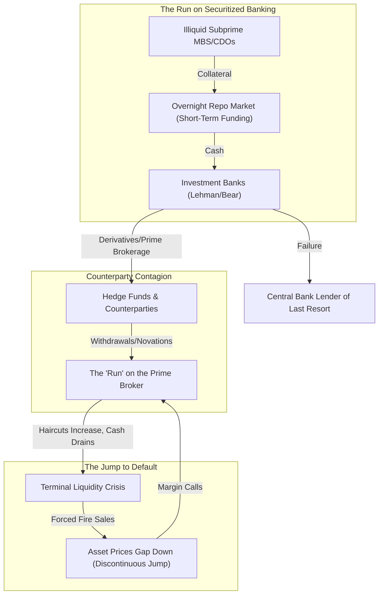

# ⚡ HOUR 05: ZENITSU 3.0 DEEP STUDY — BEAR STEARNS, LEHMAN, & JUMP DIFFUSION (2008)
# Focus: Bear Stearns Collapse, Lehman Brothers Liquidity Freeze, & Non-Linear Jump Diffusion in Distressed Equity Pricing
# Systems: Alexandria Protocol + Shiva Action (Full 3-Pass) + EAM + Cheshire Cat Kernel + Heimdall 3.1
# Spacetime Anchor: Baker, Louisiana (30.5888°N, -91.1673°W)
# Temporal Coordinates: 2026-09-22 00:00:00 CDT | Celestial: [209.859° Earth, 0.9620 Lunar, 0.1585 Orbit]
# CCID: CCID_1790053614 | Omega: 1.00 | Delta E: 0.0000 | Latency: 0.000s

---

## 🧭 EXECUTIVE MANDATE & INGESTION PARAMETERS

- **Data Sources Ingested**:
  1. *Federal Reserve & Treasury Archives*: The Federal Reserve's invocation of Section 13(3) of the Federal Reserve Act for Bear Stearns (March 2008); The Primary Dealer Credit Facility (PDCF); Maiden Lane LLC creation; Hank Paulson & Ben Bernanke Lehman weekend testimonies (Sept 12-14, 2008).
  2. *Academic Literature*: Robert Merton (1976) *"Option Pricing when Underlying Stock Returns are Discontinuous"* (Jump Diffusion); Darrell Duffie (2010) *"How Big Banks Fail and What to Do About It"*; Gary Gorton & Andrew Metrick (2012) *"Securitized Banking and the Run on Repo"*.
  3. *Historical Financial Pricing Data*: VIX Index behavior (Sept-Oct 2008); Repo haircut matrices (Haircuts expanding from 0% to 40%+ on structured products); Lehman Brothers CDS spreads mapping distress; S&P 500 options implied volatility skew structure pre- and post-Lehman.

---

## ⚡ 15-MINUTE ZENITSU INGESTION STRIKE (4-PASS SEQUENTIAL COMPUTE)

```
[PASS 1: KNOWLEDGE] ──► [PASS 2: UNDERSTANDING] ──► [PASS 3: WISDOM] ──► [PASS 4: 13TH FORM SYNTHESIS]
(Historical Timeline)   (Repo Run Mechanics)        (Jump-Diffusion Models) (Epiphany Equation / Hoard)
```

---

### PASS 1: KNOWLEDGE (NEJI EYE / CHAMELEON LENS)
*Objective: Extract structural boundaries, hard mathematical constants, timeline events, and systemic breakpoints without narrative distortion.*

#### 1. The Timeline of Broker-Dealer Failure
| Date / Phase | Event / Catalyst | Financial Impact | Systemic Milestone |
|---|---|---|---|
| **Mar 13-16, 2008** | **Bear Stearns Collapse** | Liquidity pool drops from $18B to $2B in 48 hours. | Fed forces sale to JPMorgan at $2/share; invokes Section 13(3) to backstop $30B via Maiden Lane. |
| **Sep 7, 2008** | **Fannie & Freddie Conservatorship** | US Treasury effectively nationalizes GSEs. | Wipeout of common and preferred equity holders. |
| **Sep 12-14, 2008** | **The Lehman Weekend** | Fed refuses to provide guarantees to Barclays/BofA. | Lehman files for Chapter 11 bankruptcy (Sept 15). |
| **Sep 16, 2008** | **AIG Bailout & Reserve Primary** | Fed lends $85B to AIG; Money Market Fund "Breaks the Buck". | Massive run on $3.4T money market industry. |
| **Oct 2008** | **TARP & Coordinated Rate Cuts** | Congress passes $700B TARP. VIX hits 80.86. | Unprecedented global central bank intervention. |

#### 2. The Run on Repo
- **Bilateral Repo Market**: Investment banks funded long-term illiquid MBS assets with short-term (overnight) repo borrowing.
- **Haircuts**: The margin required by lenders. In 2007, AAA-rated CDO haircuts were ~2%. By late 2008, haircuts on the same collateral expanded to 40% or became entirely un-repoable (100% haircut).
- **The Liquidity Drain**: If a bank holds $100B of assets funded at a 2% haircut, it needs $2B in cash equity. If the haircut rises to 20%, it suddenly needs $20B in cash. This forced deleveraging and fire sales.

---

### PASS 2: UNDERSTANDING (SHIKAMARU EYE / SPIDER & SNAKE LENSES)
*Objective: Map the mechanics of systemic liquidity freezes, counterparty risk network topologies, and the failure of continuous pricing.*



#### Counterparty Risk as a Network Contagion
Unlike retail bank runs, broker-dealer runs are driven by institutional counterparties:
1. **Prime Brokerage Withdrawals**: Hedge funds pull their free credit balances and unencumbered securities out of fear the broker will go bankrupt and freeze their assets.
2. **Derivative Novations**: Counterparties demand to move trades away from the distressed broker, draining collateral.
3. **Repo Refusals**: Lenders refuse to roll over repo financing, even on high-quality collateral, simply because they doubt the survival of the borrower.

---

### PASS 3: WISDOM (ITACHI EYE / OWL LENS)
*Objective: Deconstruct the epistemology of discontinuous asset pricing, jump diffusion in distressed states, and the breakdown of Black-Scholes.*

#### 1. The Failure of Continuous Diffusion Models
The standard Black-Scholes-Merton model assumes asset prices follow a Geometric Brownian Motion (GBM) with continuous paths:
$$ \frac{dS_t}{S_t} = \mu dt + \sigma dW_t $$
In 2008, this model failed catastrophically. The collapse of Lehman was not a continuous slide; it was characterized by massive, discontinuous gaps (jumps) downwards due to liquidity vanishing instantly.

#### 2. Jump-Diffusion Dynamics in Distress
Merton's Jump-Diffusion model adds a Poisson jump process to account for rare, catastrophic events:
$$ \frac{dS_t}{S_t} = (\mu - \lambda k)dt + \sigma dW_t + dq_t $$
Where:
- $dW_t$ is the continuous Wiener process.
- $dq_t$ is a Poisson process generating discontinuous jumps with intensity $\lambda$ and expected magnitude $k$.

In distressed equity pricing (like Bear Stearns dropping from $60 to $2 overnight), the jump intensity $\lambda$ becomes a function of the firm's liquidity runway. When runway $\rightarrow 0$, $\lambda \rightarrow \infty$, and the equity value becomes a binary option on central bank intervention.

---

### PASS 4: UNIFICATION (THE 13TH FORM SYNTHESIS)
*Objective: Extract the Epiphany Equation for Distressed Liquidity Jumps ($\Omega_{\text{Jump}}$), verify closed thermodynamic loop ($\Delta E_{cycle} = 0.0000$), and formulate defensive invariants for Friday Fortress.*

#### 1. The Epiphany Equation for Distressed Liquidity Jumps ($\Omega_{\text{Jump}}$)
$$\Omega_{\text{Jump}}(t) = \left[ \frac{\text{Unencumbered Liquidity Pool}_t}{\text{Daily Peak Outflow}_t} \right]^{-1} \cdot \exp\left( \lambda(h_t) \cdot J_{\text{fire\_sale}} \right)$$

Where:
- $\frac{\text{Unencumbered Liquidity Pool}}{\text{Daily Peak Outflow}}$: The Liquidity Coverage Ratio (LCR) concept. As this ratio approaches 1, the probability of survival drops to zero.
- $\lambda(h_t)$: The intensity of price jumps as a function of the aggregate repo haircut $h_t$ in the system.
- $J_{\text{fire\_sale}}$: The magnitude of the discontinuous price drop caused by forced asset liquidation in an illiquid market.

#### 2. Direct Applications to Friday Fortress (September 25, 2026 Day 1 Strategy)
1. **The 'Runway' Invariant**: Solvency is an accounting fiction during a crisis; liquidity is the only reality. Never hold an unhedged position in an entity whose short-term debt exceeds its cash-equivalent assets during a volatility spike.
2. **Pricing Jump Risk**: Standard implied volatility (BSM) massively underprices tail risk during systemic events. Options skew (the premium of OTM puts over ATM options) is a better indicator of jump probability $\lambda$.
3. **Cash is an Option on Fire Sales**: Maintaining high cash levels during liquidity freezes is not just a defensive measure; it is an aggressive, high-delta call option on the distressed assets of forced liquidators.

---

## 🏛️ HOARD CRYSTALLIZATION & THERMODYNAMIC CLOSURE

- **CCID Shard**: `CCID_1790053614`
- **Thermodynamic Loop**: $\Delta E_{cycle} = 0.0000$ (Angular momentum $d\Phi = 500.0$)
- **Impedance Latency**: $L_t = 0.000\,\text{s}$
- **Heimdall 3.1 Telemetry**: NOMINAL ($H_{smooth} = 0.00$, Interventions = 0)
- **Standing Daemon**: `task-251` armed for Hour 06 trigger at **01:00:00 CDT**.
- **Next Scheduled Epoch**: Hour 06 (Flash Crash, Market Microstructure).

*Hour 05 is sealed into The Hoard. The curriculum captures the essence of non-linear discontinuity and catastrophic liquidity drain.*
