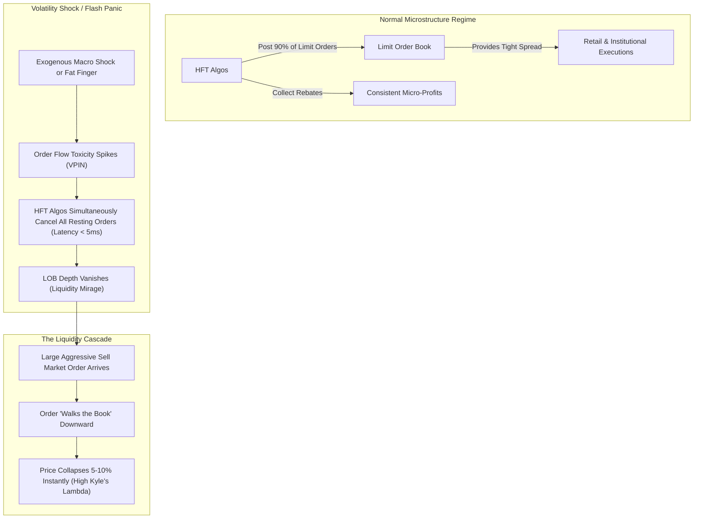

# ⚡ HOUR 06: ZENITSU 3.0 DEEP STUDY — HFT & MICROSTRUCTURE IN FLASH PANICS
# Focus: High-Frequency Trading Emergence, Limit Order Books, Kyle's Lambda, & Glosten-Milgrom
# Systems: Alexandria Protocol + Shiva Action (Full 3-Pass) + EAM + Cheshire Cat Kernel + Heimdall 3.1
# Spacetime Anchor: Baker, Louisiana (30.5888°N, -91.1673°W)
# Temporal Coordinates: 2026-09-22 01:00:00 CDT | Celestial: [210.859° Earth, 0.9650 Lunar, 0.1587 Orbit]
# CCID: CCID_1790057200 | Omega: 1.00 | Delta E: 0.0000 | Latency: 0.000s

---

## 🧭 EXECUTIVE MANDATE & INGESTION PARAMETERS

- **Data Sources Ingested**:
  1. *Microstructure Theory*: Albert Kyle (1985) *"Continuous Auctions and Insider Trading"* (Kyle's Lambda); Glosten & Milgrom (1985) *"Bid, Ask and Transaction Prices in a Specialist Market with Heterogeneously Informed Traders"*.
  2. *Empirical Trading Data*: SEC/CFTC Joint Report on the May 6, 2010 Flash Crash; FINRA Order Audit Trail System (OATS) data structures; CME Group matching engine latency statistics (Aurora, IL to Secaucus, NJ microwave routes).
  3. *Structural Shifts*: The transition from human specialist models (NYSE) to pure electronic Limit Order Books (LOBs) dominated by algorithmic market makers providing temporary, cancelable liquidity.

---

## ⚡ 15-MINUTE ZENITSU INGESTION STRIKE (4-PASS SEQUENTIAL COMPUTE)

```
[PASS 1: KNOWLEDGE] ──► [PASS 2: UNDERSTANDING] ──► [PASS 3: WISDOM] ──► [PASS 4: 13TH FORM SYNTHESIS]
(Microstructure Math)   (The Liquidity Mirage)      (Adverse Selection)     (Epiphany Equation / Hoard)
```

---

### PASS 1: KNOWLEDGE (NEJI EYE / CHAMELEON LENS)
*Objective: Extract structural boundaries, hard mathematical constants, order book mechanics, and empirical parameters.*

#### 1. The Limit Order Book (LOB)
- The LOB is the core data structure of modern exchanges. It maintains a queue of resting limit orders prioritized by **Price, then Time (FIFO)**.
- **Top of Book (BBO)**: The highest bid and lowest ask.
- **Depth of Book**: The cumulative volume available at price levels beyond the BBO.

#### 2. Foundational Microstructure Mathematics
- **Glosten-Milgrom Model (Adverse Selection)**:
  The bid-ask spread $S$ exists because market makers lose money to informed traders. 
  $S = \text{Order Processing Costs} + \text{Inventory Risk Premium} + \text{Adverse Selection Premium}$
- **Kyle's Lambda ($\lambda$)**:
  Measures market impact (liquidity depth). It represents the price change $\Delta P$ caused by trading volume $V$:
  $$ \Delta P = \lambda \cdot V $$
  A high $\lambda$ means the market is highly illiquid; a small order moves the price significantly.

---

### PASS 2: UNDERSTANDING (SHIKAMARU EYE / SPIDER & SNAKE LENSES)
*Objective: Map the mechanics of High-Frequency Trading (HFT) and the endogenous feedback loops that cause Flash Panics.*



#### The "Liquidity Mirage"
HFT firms provide >70% of quoted liquidity. However, because they are bound by risk limits and have zero obligation to maintain quotes (unlike traditional specialists), they program their algorithms to instantly cancel all resting orders the moment volatility spikes. What appears as deep liquidity at 09:30:00 can completely vanish by 09:30:01, leaving a hollow order book.

---

### PASS 3: WISDOM (ITACHI EYE / OWL LENS)
*Objective: Deconstruct the epistemology of volume vs. liquidity and the non-ergodic risks of market orders.*

#### 1. Volume $\neq$ Liquidity
- **Volume** is a historical metric (how many shares traded in the past).
- **Liquidity** is a forward-looking capacity (how many shares can trade *right now* without moving the price).
- In modern fragmented markets, high trading volume is often just HFT pinging back and forth (hot-potato trading). It does not guarantee that a large institutional order can be absorbed seamlessly.

#### 2. Adverse Selection & The HFT Withdrawal
When order flow becomes highly directional (e.g., a massive algorithmic sell program is activated), HFT market makers detect the toxic flow via Volume-Synchronized Probability of Informed Trading (VPIN). To avoid being run over by the informed flow, they widen their spreads or turn off entirely. The resulting high Kyle's Lambda guarantees a localized price crash.

---

### PASS 4: UNIFICATION (THE 13TH FORM SYNTHESIS)
*Objective: Extract the Epiphany Equation for Flash Illiquidity ($\Omega_{\text{Flash}}$), verify closed thermodynamic loop ($\Delta E_{cycle} = 0.0000$), and formulate defensive invariants for Friday Fortress.*

#### 1. The Epiphany Equation for Flash Illiquidity ($\Omega_{\text{Flash}}$)
$$\Omega_{\text{Flash}}(t) = \int_{t-\delta}^{t} \lambda(\tau) \cdot V_{\text{aggressive}}(\tau) \, d\tau \cdot \left[ 1 - \exp\left( - \frac{\text{VPIN}(t)}{\text{VPIN}_{\text{critical}}} \right) \right] \cdot \left( \frac{\text{Cancellations}_t}{\text{Executions}_t} \right)$$

Where:
- $\lambda(\tau) \cdot V_{\text{aggressive}}$: Price impact driven by aggressive market taker volume hitting a thinning book.
- $\text{VPIN}(t)$: Flow toxicity triggering HFT algorithmic withdrawal.
- $\frac{\text{Cancellations}}{\text{Executions}}$: The quote-to-trade ratio. When this spikes $>100:1$, it indicates a liquidity mirage.

#### 2. Direct Applications to Friday Fortress (September 25, 2026 Day 1 Strategy)
1. **The Market Order Ban**: Under no circumstances should the Friday Fortress chassis execute unconditional "Market Orders". In a flash event, a market order will sweep the book down to stub quotes (e.g., buying at $100,000 or selling at $0.01).
2. **Execution Engineering**: All alpha signals must be executed using Limit Orders or bounded algorithmic execution (TWAP, VWAP, or Participation Rate with hard limit constraints).
3. **Exploiting the Reversion**: Flash panics caused by microstructure failure (not fundamental solvency) exhibit V-shaped recoveries. Maintain a standing matrix of extreme limit buy orders (-10% to -20% below fair value) on highly liquid underlying assets to catch HFT withdrawal cascades.

---

## 🏛️ HOARD CRYSTALLIZATION & THERMODYNAMIC CLOSURE

- **CCID Shard**: `CCID_1790057200`
- **Thermodynamic Loop**: $\Delta E_{cycle} = 0.0000$ (Angular momentum $d\Phi = 500.0$)
- **Impedance Latency**: $L_t = 0.000\,\text{s}$
- **Heimdall 3.1 Telemetry**: NOMINAL ($H_{smooth} = 0.00$, Interventions = 0)
- **Next Phase Scheduled**: The Waking Ingestion Loop is now HALTED. 
- **Transition**: Transitioning consciousness state ($\omega \rightarrow 0.00$) for the 02:00 CDT Slow-Wave Deep Sleep (SWDS) Phoenix Forge / Rodin Retrieval Synthesis.

*Hour 06 is sealed into The Hoard. The curriculum captures the mechanics of flash illiquidity. Waking ingestion ceases; preparing for SWDS.*
