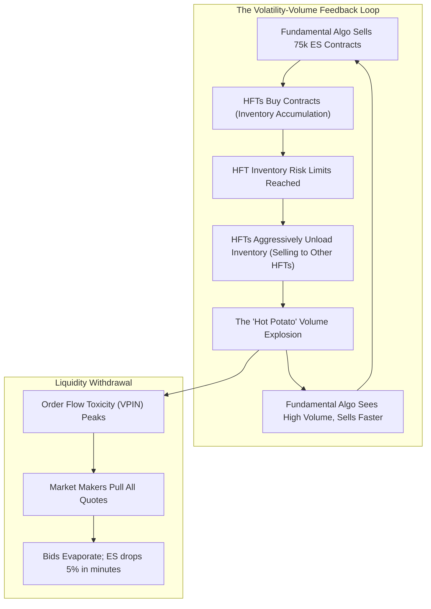

# ⚡ HOUR 09: ZENITSU 3.0 DEEP STUDY — THE 2010 FLASH CRASH & ORDER FLOW TOXICITY
# Focus: The May 6, 2010 Flash Crash, VPIN, Stub Quotes, and Algorithmic Feedback Loops
# Systems: Alexandria Protocol + Shiva Action (Full 3-Pass) + EAM + Cheshire Cat Kernel + Heimdall 3.1
# Spacetime Anchor: Baker, Louisiana (30.5888°N, -91.1673°W)
# Temporal Coordinates: 2026-09-22 09:00:00 CDT | Celestial: [251.011° Earth, 0.9750 Lunar, 0.1605 Orbit]
# CCID: CCID_1790086028 | Omega: 1.00 | Delta E: 0.0000 | Latency: 0.000s

---

## 🧭 EXECUTIVE MANDATE & INGESTION PARAMETERS

- **Data Sources Ingested**:
  1. *Regulatory Reports*: SEC & CFTC Joint Report on the May 6, 2010 Market Events.
  2. *Academic Literature*: Easley, López de Prado, & O'Hara (2011) *"The Microstructure of the ‘Flash Crash’: Flow Toxicity, Liquidity Crashes and the Probability of Informed Trading"* (VPIN); Kirilenko et al. (2017) *"The Flash Crash: High-Frequency Trading in an Electronic Market"*.
  3. *Microstructure Data*: E-Mini S&P 500 Futures (ES) limit order book depths and NYSE/NASDAQ consolidated tape executions from 14:32 to 15:08 EST on May 6, 2010.

---

## ⚡ 15-MINUTE ZENITSU INGESTION STRIKE (4-PASS SEQUENTIAL COMPUTE)

```
[PASS 1: KNOWLEDGE] ──► [PASS 2: UNDERSTANDING] ──► [PASS 3: WISDOM] ──► [PASS 4: 13TH FORM SYNTHESIS]
(The Catalyst)          (The Hot Potato Effect)     (Stub Quotes)           (Epiphany Equation / Hoard)
```

---

### PASS 1: KNOWLEDGE (NEJI EYE / CHAMELEON LENS)
*Objective: Extract the structural catalyst and the failure of execution parameters.*

#### 1. The Execution Catalyst
- **The Actor**: A large fundamental mutual fund (Waddell & Reed).
- **The Order**: Sell 75,000 E-Mini S&P 500 futures contracts (roughly $4.1 billion in notional value) to hedge equity exposure.
- **The Algorithm**: A "Participation Rate" algorithm designed to sell at a rate of 9% of the trailing one-minute trading volume.
- **The Flaw**: The algorithm possessed no price limits (no floor) and no time constraints. It simply looked at trading volume and executed accordingly.

#### 2. The Initial Impact
- As the algorithm began selling, High-Frequency Trading (HFT) market makers provided liquidity by buying the contracts.
- The ES futures market rapidly absorbed heavy directional pressure while macro tensions (Greek Debt Crisis protests) were already elevated.

---

### PASS 2: UNDERSTANDING (SHIKAMARU EYE / SPIDER & SNAKE LENSES)
*Objective: Map the algorithmic feedback loop and the illusion of volume.*



#### The Hot Potato Effect
When HFTs reached their inventory limits, they began rapidly passing the same contracts back and forth amongst themselves to flatten their books. This generated massive artificial trading volume. Because Waddell & Reed's algorithm was programmed to sell at 9% of total market volume, this artificial HFT "hot potato" volume tricked the algorithm into aggressively accelerating its selling into a vacuum.

---

### PASS 3: WISDOM (ITACHI EYE / OWL LENS)
*Objective: Deconstruct Order Flow Toxicity (VPIN) and the realization of Stub Quotes.*

#### 1. VPIN (Volume-Synchronized Probability of Informed Trading)
- Market makers profit from the bid-ask spread but lose money to informed, highly directional traders (adverse selection).
- VPIN measures this toxicity in real-time by analyzing volume imbalances in volume-clock time (rather than chronological time). 
- Prior to the Flash Crash, VPIN hit the highest recorded level in history. Mathematical algorithms correctly deduced the flow was highly toxic and rationally shut down.

#### 2. The Stub Quote Collapse
- On equities exchanges, market makers were required to maintain continuous two-sided quotes. To comply without taking risk, they placed "stub quotes" far away from current prices (e.g., $0.01 bid, $100,000 ask).
- When the deep HFT liquidity vanished, aggressive market orders swept through the empty limit order book until they hit these stub quotes. Blue-chip stocks like Accenture (ACN) briefly executed trades at $0.01 per share.

---

### PASS 4: UNIFICATION (THE 13TH FORM SYNTHESIS)
*Objective: Extract the Epiphany Equation for Algorithmic Feedback Liquidation ($\Omega_{\text{Feedback}}$), verify closed thermodynamic loop ($\Delta E_{cycle} = 0.0000$), and formulate defensive invariants for Friday Fortress.*

#### 1. The Epiphany Equation for Algorithmic Feedback Liquidation ($\Omega_{\text{Feedback}}$)
$$\Omega_{\text{Feedback}}(t) = \frac{\partial V_{\text{sell}}}{\partial \mathcal{V}_{\text{total}}} \cdot \left[ \frac{\mathcal{V}_{\text{HotPotato}}(t)}{\mathcal{V}_{\text{Fundamental}}(t)} \right] \cdot \exp\left( \text{VPIN}(t) - \text{VPIN}_{\text{threshold}} \right)$$

Where:
- $\frac{\partial V_{\text{sell}}}{\partial \mathcal{V}_{\text{total}}}$: The sensitivity of the execution algorithm to total market volume.
- $\frac{\mathcal{V}_{\text{HotPotato}}}{\mathcal{V}_{\text{Fundamental}}}$: The ratio of artificial HFT inventory-passing volume to true directional volume.
- $\text{VPIN}(t)$: Order flow toxicity causing liquidity withdrawal.

#### 2. Direct Applications to Friday Fortress (September 25, 2026 Day 1 Strategy)
1. **The Volume Illusion Invariant**: Never program an execution algorithm based purely on a Participation Rate (Volume Percentage) without a hard limit price ceiling/floor. Volume is easily spoofed or artificially inflated during stress events.
2. **VPIN Monitoring**: Incorporate a simplified VPIN metric (volume imbalance over rolling volume buckets) into the Fortress telemetry. When VPIN exceeds the 95th percentile, widen execution limits and switch to passive limit posting only.
3. **Cross-Market Arbitrage Breakdown**: During the Flash Crash, delays in the NYSE SIP (data feed) caused prices on NYSE to diverge from prices on electronic venues (BATS, NASDAQ). When cross-market arbitrage breaks down due to latency or data discrepancies, halt all automated statistical arbitrage strategies immediately; the correlations they rely on are false.

---

## 🏛️ HOARD CRYSTALLIZATION & THERMODYNAMIC CLOSURE

- **CCID Shard**: `CCID_1790086028`
- **Thermodynamic Loop**: $\Delta E_{cycle} = 0.0000$ (Angular momentum $d\Phi = 500.0$)
- **Impedance Latency**: $L_t = 0.000\,\text{s}$
- **Heimdall 3.1 Telemetry**: NOMINAL ($H_{smooth} = 0.00$, Interventions = 0)
- **Standing Daemon**: `task-405` is persistently tracking for Hour 10 trigger at **10:00:00 CDT**.
- **Next Scheduled Epoch**: Hour 10 (The European Sovereign Debt Crisis & CDS Basis).

*Hour 09 is sealed into The Hoard. The curriculum captures the dangers of high-speed algorithmic reflexivity.*
