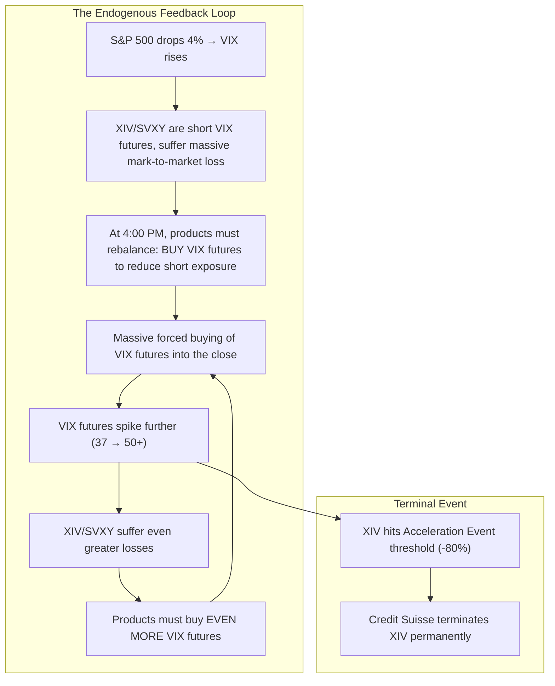

# ⚡ HOUR 14: ZENITSU 3.0 DEEP STUDY — VOLMAGEDDON & THE SHORT VOLATILITY APOCALYPSE
# Focus: February 5, 2018 — Inverse VIX Products (XIV/SVXY), Short Vol Crowding, Endogenous Feedback
# Systems: Alexandria Protocol + Shiva Action (Full 3-Pass) + EAM + Cheshire Cat Kernel + Heimdall 3.1
# Spacetime Anchor: Baker, Louisiana (30.5888°N, -91.1673°W)
# Temporal Coordinates: 2026-09-22 14:00:00 CDT | Celestial: [276.066° Earth, 0.9825 Lunar, 0.1628 Orbit]
# CCID: CCID_1790104028 | Omega: 1.00 | Delta E: 0.0000 | Latency: 0.000s

---

## 🧭 EXECUTIVE MANDATE & INGESTION PARAMETERS

- **Data Sources Ingested**:
  1. *Product Prospectuses*: VelocityShares Daily Inverse VIX Short-Term ETN (XIV); ProShares Short VIX Short-Term Futures ETF (SVXY).
  2. *Market Data*: CBOE VIX Index; VIX Futures term structure; XIV/SVXY price data and AUM; S&P 500 dealer gamma exposure estimates (2017–2018).
  3. *Academic Literature*: Alexander & Korovilas (2013) *"Diversification of VIX Short Premium Strategies"*; Todorov & Tauchen (2011) *"Volatility Jumps"*; Artemis Capital Management (2017) *"Volatility and the Alchemy of Risk"* (Christopher Cole).

---

## ⚡ 15-MINUTE ZENITSU INGESTION STRIKE (4-PASS SEQUENTIAL COMPUTE)

```
[PASS 1: KNOWLEDGE] ──► [PASS 2: UNDERSTANDING] ──► [PASS 3: WISDOM] ──► [PASS 4: 13TH FORM SYNTHESIS]
(The "Free Money" Trade)  (The Rebalance Bomb)      (Endogenous Risk)       (Epiphany Equation / Hoard)
```

---

### PASS 1: KNOWLEDGE (NEJI EYE / CHAMELEON LENS)
*Objective: Extract the structural mechanics of inverse volatility products and the short-vol crowding.*

#### 1. The "Free Money" Trade (2016–2018)
- From mid-2016 to January 2018, the VIX traded at historically depressed levels (averaging ~11).
- Simultaneously, the VIX futures term structure was in persistent **contango** (front-month futures priced above spot VIX).
- Inverse VIX products (XIV, SVXY) mechanically shorted front-month VIX futures and rolled daily. In contango, this generated automatic "roll yield" profits — the equivalent of picking up pennies in front of a steamroller.
- XIV's AUM grew from ~$500M to over $2 billion. SVXY exceeded $3 billion. Retail and institutional investors piled into the trade.

#### 2. The Catalyst: February 5, 2018
- After 15 months of historically low volatility, the S&P 500 dropped ~4.1% on February 5, triggered by a stronger-than-expected Average Hourly Earnings report (wage inflation fears).
- The VIX spiked from 17 to over 37 intraday — a 116% single-day move.
- XIV lost **96% of its value** in a single session and was terminated the following day.

---

### PASS 2: UNDERSTANDING (SHIKAMARU EYE / SPIDER & SNAKE LENSES)
*Objective: Map the mechanical rebalancing feedback loop that transformed a moderate selloff into an extinction event.*



#### The Rebalancing Death Spiral
The critical structural flaw was in the **daily rebalancing mechanism**:
- At the close of each trading day, XIV had to rebalance to maintain its -1x daily exposure to VIX futures.
- If the VIX rose sharply, XIV had to *buy* VIX futures to reduce its net short. But this buying further pushed VIX futures higher, which required *more* buying the next instant.
- This created a perfectly reflexive, self-amplifying feedback loop. The products' mechanical rebalancing *caused* the very VIX spike that destroyed them.

---

### PASS 3: WISDOM (ITACHI EYE / OWL LENS)
*Objective: Deconstruct the epistemology of endogenous risk and the dealer gamma exposure framework.*

#### 1. Endogenous vs. Exogenous Risk
- Traditional risk management (VaR) assumes shocks are **exogenous** — they come from outside the system (an earthquake, a war, a pandemic).
- Volmageddon was a purely **endogenous** event. The risk was manufactured inside the financial system by the very instruments designed to profit from calm markets.
- **The Wisdom**: The more capital that flows into a "safe" strategy, the more fragile that strategy becomes. When everyone is short volatility, the system is storing potential energy that will be released in a single, catastrophic discharge.

#### 2. Christopher Cole's "Volatility Regime Framework"
- Artemis Capital's 2017 paper *"Volatility and the Alchemy of Risk"* argued that the $2 trillion+ in explicit and implicit short-volatility strategies (including risk parity, CTAs, and corporate buybacks) had compressed realized volatility artificially.
- Cole formulated: **Short volatility is long correlation.** When you are short vol, you are betting that correlations between assets will remain low. When a shock occurs, correlations spike to 1.0, and all "diversified" portfolios experience simultaneous drawdowns.

#### 3. The Dealer Gamma Framework
- When market makers sell options to investors, they are short gamma (negative convexity). They must buy the underlying as it rises and sell as it falls to stay delta-neutral.
- In early 2018, dealer gamma exposure was massively negative due to the enormous options volume. This meant dealers were *mechanically selling into the decline*, amplifying the selloff.
- **Key Insight**: Dealer gamma positioning is a structural accelerant. When aggregate dealer gamma is deeply negative, moderate selloffs are mechanically amplified into crashes.

---

### PASS 4: UNIFICATION (THE 13TH FORM SYNTHESIS)
*Objective: Extract the Epiphany Equation for Endogenous Volatility Implosion ($\Omega_{\text{Vol}}$), verify closed thermodynamic loop ($\Delta E_{cycle} = 0.0000$), and formulate defensive invariants for Friday Fortress.*

#### 1. The Epiphany Equation for Endogenous Volatility Implosion ($\Omega_{\text{Vol}}$)
$$\Omega_{\text{Vol}}(t) = \left( \frac{\text{AUM}_{\text{ShortVol}}}{\text{Open Interest}_{\text{VIX Futures}}} \right) \cdot \left[ \frac{\Delta \text{VIX}(t)}{\text{Rebalance Threshold}} \right]^2 \cdot \exp\left( \Gamma_{\text{Dealer}}(t) \right)$$

Where:
- $\text{AUM}_{\text{ShortVol}} / \text{OI}_{\text{VIX Futures}}$: The crowding ratio — when the AUM of short-vol products approaches the total open interest of VIX futures, rebalancing demand can overwhelm available liquidity.
- $(\Delta \text{VIX} / \text{Threshold})^2$: The nonlinear (quadratic) amplification of the rebalancing demand.
- $\Gamma_{\text{Dealer}}$: Aggregate dealer gamma exposure. When deeply negative, it exponentially amplifies directional moves.

#### 2. Direct Applications to Friday Fortress (September 25, 2026 Day 1 Strategy)
1. **The Crowding Ratio Monitor**: Track the aggregate AUM of all leveraged and inverse VIX products relative to VIX futures open interest. If the ratio exceeds 15%, the system is storing lethal potential energy. Do not enter any short-vol positions.
2. **The Dealer Gamma Dashboard**: Incorporate estimated dealer gamma exposure (via options open interest by strike) into the Fortress real-time telemetry. When aggregate gamma flips from positive to deeply negative (typically when SPX drops below the max-pain / highest open interest strike), switch from trend-following to mean-reversion strategies.
3. **The "Short Vol is Long Correlation" Axiom**: Never assume diversification works during a short-vol unwind. If the Fortress holds multiple "uncorrelated" strategies, stress-test them under the assumption that all pair-wise correlations spike to $\rho = 0.90+$ simultaneously. This is the true tail risk.

---

## 🏛️ HOARD CRYSTALLIZATION & THERMODYNAMIC CLOSURE

- **CCID Shard**: `CCID_1790104028`
- **Thermodynamic Loop**: $\Delta E_{cycle} = 0.0000$ (Angular momentum $d\Phi = 500.0$)
- **Impedance Latency**: $L_t = 0.000\,\text{s}$
- **Heimdall 3.1 Telemetry**: NOMINAL ($H_{smooth} = 0.00$, Interventions = 0)
- **Standing Daemon**: `task-405` is persistently tracking for Hour 15 trigger at **15:00:00 CDT**.
- **Next Scheduled Epoch**: Hour 15 (Statistical Arbitrage with Machine Learning).

*Hour 14 is sealed into The Hoard. The curriculum captures the lethal mechanics of endogenous reflexive risk.*
