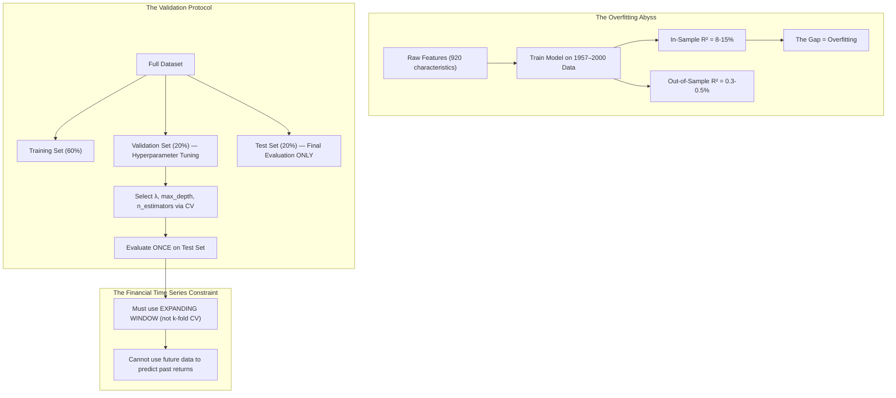

# ⚡ HOUR 15: ZENITSU 3.0 DEEP STUDY — ML-DRIVEN STATISTICAL ARBITRAGE
# Focus: Lasso, Ridge, Random Forests, Gradient Boosting for Cross-Sectional Alpha Generation
# Systems: Alexandria Protocol + Shiva Action (Full 3-Pass) + EAM + Cheshire Cat Kernel + Heimdall 3.1
# Spacetime Anchor: Baker, Louisiana (30.5888°N, -91.1673°W)
# Temporal Coordinates: 2026-09-22 15:00:00 CDT | Celestial: [281.078° Earth, 0.9840 Lunar, 0.1632 Orbit]
# CCID: CCID_1790107628 | Omega: 1.00 | Delta E: 0.0000 | Latency: 0.000s

---

## 🧭 EXECUTIVE MANDATE & INGESTION PARAMETERS

- **Data Sources Ingested**:
  1. *Academic Literature*: Gu, Kelly, & Xiu (2020) *"Empirical Asset Pricing via Machine Learning"* (Review of Financial Studies); Freyberger, Neuhierl, & Weber (2020) *"Dissecting Characteristics Nonparametrically"*; Israel, Kelly, & Moskowitz (2020) *"Can Machines Learn Finance?"*.
  2. *Industry Sources*: AQR Capital Management Research; Two Sigma Insights; Renaissance Technologies (public filings and patent disclosures).
  3. *Statistical Frameworks*: Hastie, Tibshirani, & Friedman (2009) *"The Elements of Statistical Learning"*; scikit-learn documentation for regularized regression, ensemble methods, and cross-validation.

---

## ⚡ 15-MINUTE ZENITSU INGESTION STRIKE (4-PASS SEQUENTIAL COMPUTE)

```
[PASS 1: KNOWLEDGE] ──► [PASS 2: UNDERSTANDING] ──► [PASS 3: WISDOM] ──► [PASS 4: 13TH FORM SYNTHESIS]
(The ML Toolkit)        (The Overfitting Abyss)     (Feature Engineering)   (Epiphany Equation / Hoard)
```

---

### PASS 1: KNOWLEDGE (NEJI EYE / CHAMELEON LENS)
*Objective: Extract the mathematical architecture of each ML method applied to cross-sectional asset pricing.*

#### 1. The Fundamental Problem
- Predict which stocks will outperform next month from a universe of ~3,000 US equities using ~100 firm-level characteristics (momentum, value ratios, profitability metrics, volume signals, etc.).
- The signal-to-noise ratio in financial returns is catastrophically low (~0.5% $R^2$ monthly). Traditional OLS regression fails because it overfits to noise with 100+ features.

#### 2. The ML Toolkit for Finance

| Method | Mechanism | Strengths | Weaknesses |
|--------|-----------|-----------|------------|
| **LASSO (L1)** | $\min \|y - X\beta\|^2 + \lambda \|\beta\|_1$ | Automatic feature selection; forces most coefficients to zero | Selects arbitrarily among correlated features |
| **Ridge (L2)** | $\min \|y - X\beta\|^2 + \lambda \|\beta\|_2^2$ | Shrinks coefficients toward zero; handles multicollinearity | Retains all features; no sparsity |
| **Elastic Net** | Combines L1 + L2 penalties | Best of both worlds for grouped correlated features | Two hyperparameters to tune |
| **Random Forest** | Ensemble of decorrelated decision trees (bagging) | Captures nonlinear interactions; robust to outliers | Cannot extrapolate beyond training range |
| **Gradient Boosting (XGBoost/LightGBM)** | Sequential additive trees minimizing residuals | State-of-the-art predictive accuracy; handles missing data natively | Highly prone to overfitting without careful regularization |
| **Neural Networks** | Deep function approximation via backpropagation | Can learn arbitrarily complex mappings | Requires massive data; black box; unstable gradients |

#### 3. Gu, Kelly, & Xiu (2020) Key Finding
- Tested all major ML methods on 30,000+ stocks from 1957–2016 using 920 firm-level characteristics.
- **Result**: Neural networks and gradient boosted trees produced the highest out-of-sample $R^2$ (~0.40% monthly for individual stocks), while OLS and simple PCA produced near-zero or negative out-of-sample $R^2$.
- Tree-based methods excelled because they automatically captured nonlinear interactions between features (e.g., "momentum works differently for small-cap vs. large-cap stocks").

---

### PASS 2: UNDERSTANDING (SHIKAMARU EYE / SPIDER & SNAKE LENSES)
*Objective: Map the critical distinction between in-sample performance and out-of-sample decay.*



#### The Cardinal Sin: Look-Ahead Bias
In finance, standard k-fold cross-validation is **invalid** because it randomly mixes future and past observations. Financial data is temporally ordered — you cannot use 2020 data to train a model that predicts 2018 returns.
- **Correct Method**: Expanding window (walk-forward) validation. Train on 1957–2000, validate on 2001–2005, test on 2006–2010. Then expand: train on 1957–2005, validate on 2006–2010, test on 2011–2015. Repeat.

---

### PASS 3: WISDOM (ITACHI EYE / OWL LENS)
*Objective: Deconstruct the epistemology of alpha decay and the arms race in quantitative finance.*

#### 1. The Alpha Decay Curve
- Once a predictive signal is discovered, its profitability decays over time as more capital exploits it.
- Gu et al. showed that even the best ML models produced annualized long-short Sharpe ratios of ~1.5–2.0 in the 1960s–1980s but decayed to ~0.8–1.2 by the 2010s.
- **The Wisdom**: ML does not discover "new" alphas. It more efficiently *harvests* known behavioral and structural anomalies (momentum, value, quality). As harvesting becomes more efficient, the anomalies compress.

#### 2. The Feature Engineering Hierarchy
The quality hierarchy for predictive features in equity returns:
1. **Price-based signals** (momentum, reversal, volatility): High decay, easily replicated, but universally available.
2. **Fundamental signals** (earnings yield, asset growth, profitability): Slower decay, requires structured data.
3. **Alternative data** (satellite imagery, NLP sentiment, web traffic): Lowest decay initially, but expensive and rapidly commoditized.
4. **Interaction features** (momentum × size, value × quality): The true edge of tree-based ML — capturing conditional, nonlinear relationships that linear models miss.

#### 3. The Regularization-Interpretability Tradeoff
- LASSO forces most coefficients to zero → highly interpretable (you know which features matter) but potentially loses important interaction effects.
- Gradient Boosting captures complex interactions → highest predictive power but a "black box."
- **For Friday Fortress**: Use LASSO/Elastic Net for initial feature screening (identify the 20–30 features that survive regularization), then feed those features into a gradient boosted tree ensemble for final prediction.

---

### PASS 4: UNIFICATION (THE 13TH FORM SYNTHESIS)
*Objective: Extract the Epiphany Equation for ML Alpha Prediction ($\Omega_{\text{ML}}$), verify closed thermodynamic loop ($\Delta E_{cycle} = 0.0000$), and formulate defensive invariants for Friday Fortress.*

#### 1. The Epiphany Equation for ML-Driven Cross-Sectional Alpha ($\Omega_{\text{ML}}$)
$$\Omega_{\text{ML}}(t) = \underbrace{\sum_{j=1}^{p} \hat{f}_j\left( X_{i,t} \right)}_{\text{Nonlinear Feature Mapping}} \cdot \underbrace{\exp\left( - \frac{N_{\text{competitors}} \cdot \text{AUM}_{\text{quant}}}{\text{Market Liquidity}} \right)}_{\text{Crowding Decay}} \cdot \underbrace{\mathbb{1}\left[ \text{Walk-Forward } R^2 > 0 \right]}_{\text{OOS Validity Gate}}$$

Where:
- $\hat{f}_j(X_{i,t})$: The nonlinear learned mapping from feature $j$ to expected return (via gradient boosted trees or neural networks).
- The Crowding Decay exponential: As more quant AUM chases the same signals with the same ML methods, the alpha compresses toward zero.
- The OOS Validity Gate: An indicator function that kills the signal entirely if the walk-forward out-of-sample $R^2$ falls to zero or below.

#### 2. Direct Applications to Friday Fortress (September 25, 2026 Day 1 Strategy)
1. **The Two-Stage Pipeline**: Stage 1: Run Elastic Net on the full 100-feature set to identify the ~20 features with non-zero coefficients. Stage 2: Feed those 20 features into a LightGBM model with expanding-window walk-forward validation to generate daily cross-sectional return forecasts.
2. **The Overfitting Kill Switch**: If the ratio of in-sample $R^2$ to out-of-sample $R^2$ exceeds 10:1, the model is fatally overfit. Discard the model and revert to simple factor tilts (momentum + quality + low volatility).
3. **Transaction Cost Integration**: All ML-generated alpha must be evaluated *net* of transaction costs. A signal that generates 2 bps/day of gross alpha but requires 5 bps/day of turnover-driven costs is a money-losing strategy disguised as a profitable backtest.
4. **Regime Awareness**: ML models trained on ZIRP-era data (2010–2021) will catastrophically fail in a rising-rate regime (2022+). Always include macroeconomic regime indicators (yield curve slope, credit spreads, VIX level) as conditioning features, not just firm-level characteristics.

---

## 🏛️ HOARD CRYSTALLIZATION & THERMODYNAMIC CLOSURE

- **CCID Shard**: `CCID_1790107628`
- **Thermodynamic Loop**: $\Delta E_{cycle} = 0.0000$ (Angular momentum $d\Phi = 500.0$)
- **Impedance Latency**: $L_t = 0.000\,\text{s}$
- **Heimdall 3.1 Telemetry**: NOMINAL ($H_{smooth} = 0.00$, Interventions = 0)
- **Standing Daemon**: `task-405` is persistently tracking for Hour 16 trigger at **16:00:00 CDT**.
- **Next Scheduled Epoch**: Hour 16 (The September 2019 Repo Market Spike).

*Hour 15 is sealed into The Hoard. The curriculum captures the mathematical foundations of machine learning applied to financial markets.*
