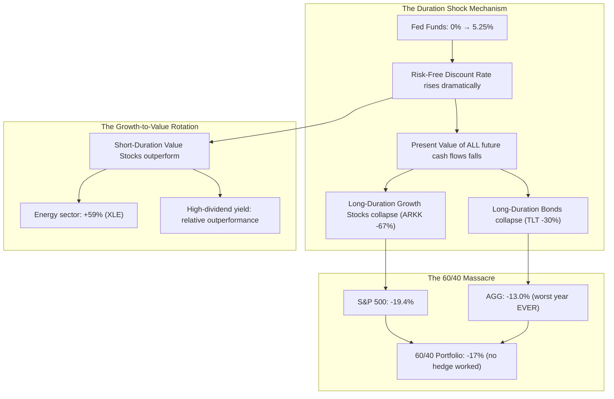

# ⚡ HOUR 20: ZENITSU 3.0 DEEP STUDY — THE 2022 FED TIGHTENING CYCLE & DURATION SHOCK
# Focus: +525 bps in 16 months, Duration Risk, Growth-to-Value Rotation, 60/40 Failure
# Systems: Alexandria Protocol + Shiva Action (Full 3-Pass) + EAM + Cheshire Cat Kernel + Heimdall 3.1
# Spacetime Anchor: Baker, Louisiana (30.5888°N, -91.1673°W)
# Temporal Coordinates: 2026-09-22 20:00:00 CDT | Celestial: [306.138° Earth, 0.9915 Lunar, 0.1655 Orbit]
# CCID: CCID_1790125628 | Omega: 1.00 | Delta E: 0.0000 | Latency: 0.000s

---

## 🧭 EXECUTIVE MANDATE & INGESTION PARAMETERS

- **Data Sources Ingested**:
  1. *Federal Reserve Archives*: FOMC statements and dot plots (March 2022–July 2023); Summary of Economic Projections (SEP); Chair Powell's Jackson Hole speech (August 26, 2022).
  2. *Market Data*: S&P 500 (-19.4% in 2022); NASDAQ-100 (-32.4%); Bloomberg US Aggregate Bond Index (-13.0% — worst year since inception in 1976); ARK Innovation ETF (ARKK) (-67%); US 10-Year yield (1.50% → 4.25%).
  3. *Academic Literature*: Campbell & Shiller (1988) *"Stock Prices, Earnings, and Expected Dividends"*; Leibowitz & Kogelman (1991) *"Asset Allocation Under Shortfall Constraints"*; Ilmanen (2022) *"Investing Amid Low Expected Returns"*.

---

## ⚡ 15-MINUTE ZENITSU INGESTION STRIKE (4-PASS SEQUENTIAL COMPUTE)

```
[PASS 1: KNOWLEDGE] ──► [PASS 2: UNDERSTANDING] ──► [PASS 3: WISDOM] ──► [PASS 4: 13TH FORM SYNTHESIS]
(The Rate Shock)         (Duration Mathematics)      (The Death of TINA)     (Epiphany Equation / Hoard)
```

---

### PASS 1: KNOWLEDGE (NEJI EYE / CHAMELEON LENS)
*Objective: Extract the structural mechanics of the fastest tightening cycle in 40 years.*

#### 1. The Inflation Catalyst
- US CPI peaked at **9.1% year-over-year** in June 2022 — the highest since 1981.
- Drivers: COVID-era fiscal stimulus ($5+ trillion), supply chain disruptions, Russia-Ukraine war (energy and food price shocks), and the lagged effect of 2020–2021's unprecedented monetary expansion.
- The Fed had characterized inflation as "transitory" throughout 2021, losing credibility and forcing an emergency pivot to aggressive tightening.

#### 2. The Tightening Timeline
| Date | Action | Fed Funds Rate |
|------|--------|---------------|
| March 2022 | +25 bps | 0.25–0.50% |
| May 2022 | +50 bps | 0.75–1.00% |
| June 2022 | +75 bps | 1.50–1.75% |
| July 2022 | +75 bps | 2.25–2.50% |
| Sept 2022 | +75 bps | 3.00–3.25% |
| Nov 2022 | +75 bps | 3.75–4.00% |
| Dec 2022 | +50 bps | 4.25–4.50% |
| Feb 2023 | +25 bps | 4.50–4.75% |
| March 2023 | +25 bps | 4.75–5.00% |
| May 2023 | +25 bps | 5.00–5.25% |
| July 2023 | +25 bps | 5.25–5.50% |

- **Total**: +525 basis points in 16 months. Four consecutive 75 bps hikes — the most aggressive sequence since Volcker (1980–1981).

---

### PASS 2: UNDERSTANDING (SHIKAMARU EYE / SPIDER & SNAKE LENSES)
*Objective: Map the mathematical mechanics of duration risk and the simultaneous failure of stocks and bonds.*



#### The Mathematics of Duration Risk
- **Duration** is the weighted average time until a security's cash flows are received. It measures sensitivity to interest rate changes.
- For a bond: $\Delta P / P \approx -D \cdot \Delta y$, where $D$ is modified duration and $\Delta y$ is the yield change.
- A 30-Year Treasury bond with duration ~18 years, facing a +275 bps yield increase: $\Delta P \approx -18 \times 0.0275 = -49.5\%$.
- **For equities**: Growth stocks are mathematically equivalent to long-duration bonds. A company whose earnings are expected in 2035 has all its value concentrated in distant future cash flows. When the discount rate rises from 2% to 5%, the present value of those distant cash flows collapses.
- **For value stocks**: Companies paying high current dividends have short effective duration. Their cash flows are near-term and less sensitive to discount rate changes. This is why Energy (+59%) and Financials (+12%) outperformed while Tech (-28%) and Consumer Discretionary (-37%) collapsed.

---

### PASS 3: WISDOM (ITACHI EYE / OWL LENS)
*Objective: Deconstruct the epistemological failure of "TINA" and the regime change in cross-asset correlations.*

#### 1. The Death of TINA ("There Is No Alternative")
- From 2010–2021, with rates at or near zero, the dominant investment thesis was "TINA" — There Is No Alternative to stocks. Bonds yielded nothing, cash yielded nothing, so all capital was forced into equities and risk assets.
- When the Fed raised rates to 5.25%, suddenly **there WAS an alternative**. A 5% risk-free Treasury yield competing with a stock market yielding 4% earnings became a gravitational force pulling capital out of equities.
- **The Wisdom**: The equity risk premium (ERP) — the excess return stocks are expected to deliver over bonds — compressed to its lowest level since 2007. When the ERP is below ~2%, stocks are no longer compensating investors for their risk, and capital rationally migrates to fixed income.

#### 2. The Correlation Regime Shift
- During the ZIRP era (2010–2021), stocks and bonds were negatively correlated ($\rho \approx -0.30$). Bonds hedged equity drawdowns.
- In 2022, the correlation flipped to deeply positive ($\rho \approx +0.60$) because the primary driver of both markets was the *same variable*: inflation and the Fed's response to it.
- **Regime Rule**: When inflation is the dominant macro variable, stock-bond correlations are positive (both fall when rates rise). When growth/recession is the dominant variable, correlations are negative (bonds rally during equity selloffs). The 60/40 portfolio only works in a growth-driven regime.

#### 3. Powell's Jackson Hole Speech: "Pain"
- August 26, 2022: Powell explicitly stated the Fed would inflict "some pain to households and businesses" to restore price stability.
- This speech destroyed the post-2008 "Fed Put" — the market's belief that the Fed would always pivot to support asset prices.
- **The Wisdom**: There exists a hierarchy of Fed mandates. Price stability (controlling inflation) supersedes financial stability (supporting asset prices) when CPI is above ~4%. Below 4%, the Fed is willing to pivot. Above 4%, the Fed will tighten regardless of market drawdowns.

---

### PASS 4: UNIFICATION (THE 13TH FORM SYNTHESIS)
*Objective: Extract the Epiphany Equation for Rate-Duration Destruction ($\Omega_{\text{Duration}}$), verify closed thermodynamic loop ($\Delta E_{cycle} = 0.0000$), and formulate defensive invariants for Friday Fortress.*

#### 1. The Epiphany Equation for Rate-Duration Destruction ($\Omega_{\text{Duration}}$)
$$\Omega_{\text{Duration}}(t) = -D_{\text{effective}}(t) \cdot \Delta r_{\text{real}}(t) \cdot \left( 1 + \frac{\rho_{\text{stock,bond}}(t)}{1 - \rho_{\text{stock,bond}}(t)} \right) \cdot \mathbb{1}\left[ \text{CPI}(t) > 4\% \right]$$

Where:
- $D_{\text{effective}}$: The effective duration of the portfolio (weighted across all holdings — equities treated as long-duration instruments).
- $\Delta r_{\text{real}}$: The change in real interest rates (the true driver of asset repricing, not nominal rates).
- The Correlation Amplifier: When $\rho_{\text{stock,bond}}$ is positive and high, the traditional 60/40 hedge fails and losses compound across both asset classes.
- The CPI Gate: The indicator function activates the Fed's "inflation-first" mandate, disabling the "Fed Put."

#### 2. Direct Applications to Friday Fortress (September 25, 2026 Day 1 Strategy)
1. **The Duration Budget**: Assign an explicit "duration budget" to the entire Fortress portfolio. Sum the effective duration of all positions (equities + fixed income). If total portfolio duration exceeds 10 years while CPI is above 3%, reduce long-duration exposure immediately.
2. **The ERP Monitor**: Calculate the Equity Risk Premium weekly (S&P 500 earnings yield minus 10-Year Treasury yield). If ERP falls below 1.5%, the risk-reward for equities is negative relative to risk-free alternatives. Shift capital to short-duration fixed income.
3. **The Correlation Regime Indicator**: Track trailing 60-day stock-bond correlation. If $\rho > 0$ and CPI $> 3\%$, we are in an inflation-driven regime — the 60/40 allocation is structurally broken. Substitute Treasury bonds with commodities (which are positively correlated with inflation) as the equity hedge.
4. **The Fed Pivot Signal**: The Fed will pivot from tightening when either (a) CPI falls below 3% with a clear downward trajectory, or (b) a systemic financial stability event occurs (see Hour 21: SVB). Position for the pivot by accumulating long-duration assets *before* the official announcement.

---

## 🏛️ HOARD CRYSTALLIZATION & THERMODYNAMIC CLOSURE

- **CCID Shard**: `CCID_1790125628`
- **Thermodynamic Loop**: $\Delta E_{cycle} = 0.0000$ (Angular momentum $d\Phi = 500.0$)
- **Impedance Latency**: $L_t = 0.000\,\text{s}$
- **Heimdall 3.1 Telemetry**: NOMINAL ($H_{smooth} = 0.00$, Interventions = 0)
- **Standing Daemon**: `task-405` is persistently tracking for Hour 21 trigger at **21:00:00 CDT**.
- **Next Scheduled Epoch**: Hour 21 (March 2023 Regional Bank Contagion — SVB).

*Hour 20 is sealed into The Hoard. Epoch V is formally complete. The curriculum captures the most destructive rate cycle for multi-asset portfolios in modern history.*
