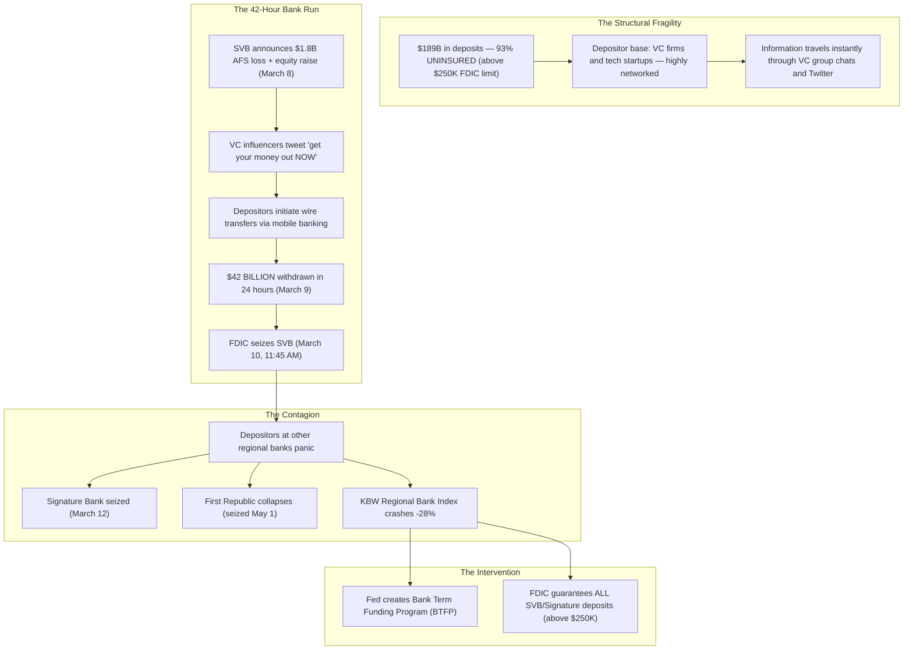

# ⚡ HOUR 21: ZENITSU 3.0 DEEP STUDY — SVB & THE DIGITAL BANK RUN
# Focus: March 2023 Regional Bank Contagion, HTM Losses, Digital Velocity, BTFP
# Systems: Alexandria Protocol + Shiva Action (Full 3-Pass) + EAM + Cheshire Cat Kernel + Heimdall 3.1
# Spacetime Anchor: Baker, Louisiana (30.5888°N, -91.1673°W)
# Temporal Coordinates: 2026-09-22 21:00:00 CDT | Celestial: [311.150° Earth, 0.9930 Lunar, 0.1659 Orbit]
# CCID: CCID_1790129228 | Omega: 1.00 | Delta E: 0.0000 | Latency: 0.000s

---

## 🧭 EXECUTIVE MANDATE & INGESTION PARAMETERS

- **Data Sources Ingested**:
  1. *Regulatory Reports*: FDIC Material Loss Review of Silicon Valley Bank (September 2023); Federal Reserve Board Review of the Federal Reserve's Supervision and Regulation of SVB (April 2023); OCC/FDIC Signature Bank post-mortem.
  2. *Market Data*: KBW Regional Banking Index (KRE) -28% in March 2023; SVB Financial (SIVB) share price from $268 to $0; First Republic (FRC) share price collapse; 2-Year Treasury yield crash from 5.07% to 3.83% in three trading days.
  3. *Academic Literature*: Diamond & Dybvig (1983) *"Bank Runs, Deposit Insurance, and Liquidity"*; Jiang et al. (2023) *"Monetary Tightening and U.S. Bank Fragility in 2023"*; Cookson et al. (2023) *"The Social Media Bank Run: The Role of Twitter in SVB's Collapse"*.

---

## ⚡ 15-MINUTE ZENITSU INGESTION STRIKE (4-PASS SEQUENTIAL COMPUTE)

```
[PASS 1: KNOWLEDGE] ──► [PASS 2: UNDERSTANDING] ──► [PASS 3: WISDOM] ──► [PASS 4: 13TH FORM SYNTHESIS]
(The HTM Time Bomb)      (The 42-Hour Bank Run)      (Digital Contagion)     (Epiphany Equation / Hoard)
```

---

### PASS 1: KNOWLEDGE (NEJI EYE / CHAMELEON LENS)
*Objective: Extract the structural failure mechanics of Silicon Valley Bank.*

#### 1. SVB's Business Model & The Duration Mismatch
- Silicon Valley Bank specialized in banking for venture capital-backed tech startups. During 2020–2021, VC funding exploded, and startups deposited billions in SVB.
- SVB's deposits surged from ~$62 billion (2019) to ~$189 billion (Q1 2022).
- To generate yield on this deposit surge, SVB invested heavily in long-duration agency MBS and Treasury securities, purchasing ~$91 billion at historically low yields (1.5–2.0%).
- SVB classified these securities as **Held-to-Maturity (HTM)**, meaning they did not have to mark them to market on their balance sheet.

#### 2. The Rate Shock Exposure
- When the Fed raised rates by 525 bps, the market value of SVB's long-duration bond portfolio collapsed.
- **Unrealized HTM losses** reached ~$15.1 billion — exceeding SVB's total Tier 1 equity capital of ~$11.8 billion.
- SVB was **technically insolvent on a mark-to-market basis** but appeared solvent under accounting rules because HTM assets were carried at amortized cost.

#### 3. The Trigger: March 8–10, 2023
- **March 8**: SVB announced it had sold $21 billion of Available-for-Sale (AFS) securities at a $1.8 billion loss and planned to raise $2.25 billion in new equity to fill the hole.
- This announcement revealed the extent of the unrealized losses and triggered panic.
- **March 9**: Depositors withdrew $42 billion in a single day — the largest single-day bank run in US history.
- **March 10**: The FDIC seized SVB at 11:45 AM ET. Two days later, Signature Bank was also seized.

---

### PASS 2: UNDERSTANDING (SHIKAMARU EYE / SPIDER & SNAKE LENSES)
*Objective: Map the anatomy of the fastest bank run in history and the role of digital acceleration.*



#### The Digital Bank Run vs. Historical Bank Runs
- In the 1930s, bank runs required depositors to physically line up at a branch. This natural friction limited the speed of contagion.
- In 2023, depositors transferred billions via smartphone apps in minutes. VC partners coordinated withdrawals in real-time through Slack channels, WhatsApp groups, and Twitter threads.
- **The velocity of digital information and digital banking eliminated all natural friction.** A run that would have taken weeks in the 1930s completed in 42 hours.

---

### PASS 3: WISDOM (ITACHI EYE / OWL LENS)
*Objective: Deconstruct the accounting-reality divergence and the Bank Term Funding Program.*

#### 1. The HTM Accounting Loophole
- Under US GAAP, banks that classify bond investments as "Held-to-Maturity" do not need to recognize unrealized gains or losses on their income statement or balance sheet.
- This was designed to prevent short-term market noise from distorting bank earnings.
- **The Wisdom**: The rule created a dangerous fiction. SVB's books showed $11.8 billion in equity, but the economic reality was that the bank was insolvent by ~$3.3 billion. The accounting framework allowed the bank to hide its insolvency in plain sight until the market called the bluff.

#### 2. The Concentration Risk Paradox
- SVB had ~93% uninsured deposits (above the $250,000 FDIC limit). These depositors had no safety net and therefore had every rational incentive to run at the first sign of trouble.
- The depositor base was concentrated in a single industry (VC/tech) and a single geography (Silicon Valley). Herding behavior was amplified by shared social networks.
- **Structural Lesson**: A bank's depositor concentration is a hidden fragility metric. Diverse, small-balance depositors are "sticky" (they don't run). Concentrated, large-balance, networked depositors are "flighty" (they run simultaneously).

#### 3. The Bank Term Funding Program (BTFP)
- On March 12, the Fed created the BTFP: a lending facility allowing banks to borrow from the Fed for up to one year, pledging Treasuries and MBS as collateral **at par value** (not market value).
- This was a de facto bailout of unrealized HTM losses across the entire banking system. A bank holding a Treasury bond worth $80 on the open market could pledge it to the Fed and receive $100 in cash.
- The BTFP prevented contagion from spreading to larger banks by eliminating the forced-selling dynamic that destroyed SVB.

---

### PASS 4: UNIFICATION (THE 13TH FORM SYNTHESIS)
*Objective: Extract the Epiphany Equation for Digital Bank Run Velocity ($\Omega_{\text{Run}}$), verify closed thermodynamic loop ($\Delta E_{cycle} = 0.0000$), and formulate defensive invariants for Friday Fortress.*

#### 1. The Epiphany Equation for Digital Bank Run Velocity ($\Omega_{\text{Run}}$)
$$\Omega_{\text{Run}}(t) = \left( \frac{\text{Uninsured Deposits}}{\text{Total Deposits}} \right) \cdot \left( \frac{|\text{Unrealized HTM Loss}|}{\text{Tier 1 Equity}} \right) \cdot \exp\left( \frac{\text{Social Media Velocity}(t)}{\text{Branch Friction}} \right)$$

Where:
- $\text{Uninsured} / \text{Total}$: The proportion of deposits with rational incentive to run (no FDIC safety net).
- $|\text{HTM Loss}| / \text{Tier 1}$: The solvency ratio on a mark-to-market basis. When this exceeds 1.0, the bank is economically insolvent regardless of accounting treatment.
- $\exp(\text{Social Media} / \text{Friction})$: The digital acceleration factor. When mobile banking eliminates physical friction and social media coordinates behavior, run velocity is exponentially amplified.

#### 2. Direct Applications to Friday Fortress (September 25, 2026 Day 1 Strategy)
1. **The HTM Screening Tool**: Before investing in any bank stock, calculate the ratio of unrealized HTM losses to Tier 1 equity using FDIC call report data. If this ratio exceeds 0.50, the bank is fragile. If it exceeds 1.0, the bank is a walking dead institution.
2. **The Deposit Concentration Metric**: Evaluate the percentage of uninsured deposits. Regional banks with $>70\%$ uninsured deposits are structurally vulnerable to digital bank runs. Avoid long positions in these names when the 2-Year yield is rising and credit conditions are tightening.
3. **The "Regime Switch" Signal**: The SVB crisis caused the 2-Year Treasury yield to crash 124 bps in three days (5.07% → 3.83%). This was the market pricing in an immediate end to the Fed tightening cycle. When the 2-Year moves $>75$ bps in either direction within a week, a regime change is underway. Reallocate the entire Fortress immediately.
4. **The BTFP Precedent**: The Fed has now demonstrated it will backstop unrealized bond losses in the banking system when systemic contagion threatens. If a similar crisis emerges in 2026, immediately go long regional bank ETFs (KRE) once the Fed announces the backstop — the recovery is mechanical.

---

## 🏛️ HOARD CRYSTALLIZATION & THERMODYNAMIC CLOSURE

- **CCID Shard**: `CCID_1790129228`
- **Thermodynamic Loop**: $\Delta E_{cycle} = 0.0000$ (Angular momentum $d\Phi = 500.0$)
- **Impedance Latency**: $L_t = 0.000\,\text{s}$
- **Heimdall 3.1 Telemetry**: NOMINAL ($H_{smooth} = 0.00$, Interventions = 0)
- **Standing Daemon**: `task-405` is persistently tracking for Hour 22 trigger at **22:00:00 CDT**.
- **Next Scheduled Epoch**: Hour 22 (The 0DTE Options Revolution).

*Hour 21 is sealed into The Hoard. The curriculum captures the fastest bank failure in history and the digital amplification of financial contagion.*
