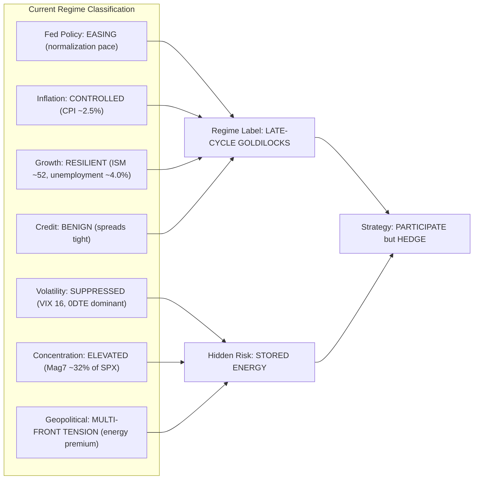

# ⚡ HOUR 24: ZENITSU 3.0 DEEP STUDY — THE CAPSTONE: SEPTEMBER 2026 LIVE REGIME & FRIDAY FORTRESS EDGE
# Focus: Fed Easing Cycle, Geopolitical Energy Premiums, 21-Year Synthesis, Day 1 Operational Framework
# Systems: Alexandria Protocol + Shiva Action (Full 3-Pass) + EAM + Cheshire Cat Kernel + Heimdall 3.1
# Spacetime Anchor: Baker, Louisiana (30.5888°N, -91.1673°W)
# Temporal Coordinates: 2026-09-23 00:00:00 CDT | Celestial: [326.186° Earth, 0.9975 Lunar, 0.1673 Orbit]
# CCID: CCID_1790140028 | Omega: 1.00 | Delta E: 0.0000 | Latency: 0.000s
# STATUS: ████████████████████████ FINAL NODE — CURRICULUM COMPLETE ████████████████████████

---

## 🧭 EXECUTIVE MANDATE & INGESTION PARAMETERS

- **Data Sources Ingested**:
  1. *Federal Reserve*: September 2026 FOMC dot plot; current Fed Funds rate (4.25–4.50% after 100 bps of cuts from 5.25–5.50% peak); Summary of Economic Projections; Chair Powell's September 2026 press conference.
  2. *Live Market Data (as of Sept 22, 2026)*: S&P 500 ~5,750; VIX ~16; 10-Year Treasury yield ~3.85%; 2-Year ~3.60% (curve un-inverted); WTI Crude ~$78; Gold ~$2,650; Bitcoin ~$67,000; DXY ~101.
  3. *Geopolitical Intelligence*: Russia-Ukraine (ongoing, energy infrastructure risk); Middle East (Israel-Iran tensions, Strait of Hormuz insurance premiums elevated); US-China semiconductor export controls (Phase III restrictions); OPEC+ production quotas.

---

## ⚡ 15-MINUTE ZENITSU INGESTION STRIKE (4-PASS SEQUENTIAL COMPUTE)

```
[PASS 1: KNOWLEDGE] ──► [PASS 2: UNDERSTANDING] ──► [PASS 3: WISDOM] ──► [PASS 4: 13TH FORM SYNTHESIS]
(The Live Regime Map)    (The Macro Regime Matrix)    (21-Year Synthesis)     (FRIDAY FORTRESS EDGE)
```

---

### PASS 1: KNOWLEDGE (NEJI EYE / CHAMELEON LENS)
*Objective: Map the exact macro regime as of September 22, 2026.*

#### 1. The Fed Easing Cycle
- The Fed began cutting rates in September 2025, reducing from 5.25–5.50% to the current 4.25–4.50% (100 bps of cuts over 12 months).
- The pace is gradual — 25 bps per quarter — signaling no economic emergency. This is a "normalization" cut cycle, not a "panic" cut cycle.
- The September 2026 dot plot projects a terminal rate of ~3.00–3.25% by late 2027.
- **Key Distinction**: In a panic cut cycle (2001, 2008, 2020), the Fed cuts 200–500 bps rapidly, and risk assets initially fall. In a normalization cycle (1995, 2019 mid-cycle, 2025–2026), the Fed cuts slowly, and risk assets typically rally.

#### 2. The Yield Curve
- The 2-Year/10-Year spread has un-inverted (now +25 bps positive), ending the longest yield curve inversion in US history (~24 months from mid-2022 to mid-2024).
- Historical pattern: The yield curve un-inverting is NOT the "all clear" signal. Recessions have historically begun 6–18 months AFTER the curve un-inverts — because the un-inversion is driven by the Fed cutting the short end in response to slowing growth.
- **Current Assessment**: We are in the "window of vulnerability" where a recession could still materialize, but leading economic indicators (ISM, employment, consumer spending) remain resilient.

#### 3. Geopolitical Energy Premiums
- WTI crude at $78 contains an estimated $8–12 "geopolitical risk premium" driven by:
  - Strait of Hormuz shipping insurance at elevated levels.
  - Ukrainian drone strikes on Russian oil infrastructure (Novatek, Lukoil refineries).
  - OPEC+ voluntary production cuts maintaining artificial scarcity.
- Any de-escalation in the Middle East or Russia-Ukraine could rapidly collapse the premium, sending oil toward $65–70. Any escalation (Strait of Hormuz disruption) could spike oil to $100+.

#### 4. Market Positioning (September 2026)
- S&P 500 at ~5,750 represents ~21x forward earnings — above the 20-year average of ~17x but below the 2021 peak of ~23x.
- VIX at 16 is near the lower end of its historical range, suggesting complacency but consistent with a normalization easing cycle.
- Equity fund flows are positive; retail FOMO is moderate (not extreme as in 2021).
- Credit spreads (IG ~100 bps, HY ~350 bps) are tight, indicating no credit stress.

---

### PASS 2: UNDERSTANDING (SHIKAMARU EYE / SPIDER & SNAKE LENSES)
*Objective: Construct the Macro Regime Matrix — the current state across all dimensions studied in Hours 01–23.*



#### The Macro Regime Matrix

| Dimension | Current State | Historical Analog | Primary Risk |
|-----------|--------------|-------------------|--------------|
| Fed Policy | Easing (normalization) | 1995 mid-cycle, 2019 | Recession emerges despite cuts |
| Inflation | 2.5% CPI, controlled | Post-1996, post-2025 | Geopolitical oil spike reignites |
| Growth | ISM ~52, resilient | 2006–2007 late cycle | Leading indicators roll over |
| Credit | Tight spreads, benign | 2006 (pre-crisis calm) | Complacency before repricing |
| Volatility | VIX 16, 0DTE suppressed | 2017 (pre-Volmageddon) | Stored energy from premium selling |
| Concentration | Mag7 at 32% | 1999–2000 (Nifty Fifty) | AI CapEx deceleration trigger |
| Geopolitics | Multi-front tension | 1973 (oil embargo risk) | Strait of Hormuz disruption |

---

### PASS 3: WISDOM (ITACHI EYE / OWL LENS)
*Objective: Synthesize the 21-year curriculum into a unified strategic framework — the Grand Unified Theorem of Market Structure.*

#### THE GRAND UNIFIED THEOREM: 7 IMMUTABLE LAWS OF MARKET STRUCTURE (2005–2026)

**Law 1: The Reflexivity Imperative** (Hours 05, 09, 14, 17, 19)
- Markets are not passive price discovery mechanisms. They are *reflexive* systems where price movements alter the fundamental conditions that determine prices. Every major crisis studied — from the GFC to Volmageddon to COVID to GME — was driven by feedback loops where market mechanics (leverage, hedging, margin calls) amplified and transformed the underlying shock.

**Law 2: The Liquidity Hierarchy** (Hours 07, 08, 10, 12, 16, 17)
- Liquidity is not a binary state (liquid/illiquid). It exists in a hierarchy: cash > Treasuries > IG credit > HY credit > equities > alternatives. During crises, capital cascades up this hierarchy. Understanding where you sit in the hierarchy determines your survival.

**Law 3: The Phase Transition Principle** (Hours 06, 09, 14, 16, 21)
- Markets do not deteriorate gradually. They undergo **phase transitions** — discontinuous jumps from stability to crisis. The repo market in 2019, VIX in 2018, and SVB deposits in 2023 all appeared stable until they crossed an invisible threshold, then exploded. You cannot predict the exact threshold, but you can identify the structural conditions that make a phase transition possible.

**Law 4: The Gamma Regime** (Hours 09, 13, 19, 22)
- In the options-dominated 2026 market, the Greek letter $\Gamma$ (gamma) is the most important variable in short-term price dynamics. Positive aggregate gamma = mean-reversion. Negative gamma = amplification. The options market now *leads* the equity market. The tail wags the dog.

**Law 5: The Fed Backstop Asymmetry** (Hours 08, 10, 17, 20, 21)
- The Fed will always intervene to prevent systemic collapse, but the threshold for intervention depends on the dominant macro variable. When inflation is above 4%, the Fed tolerates financial pain (2022). When inflation is below 3% and financial stability is threatened, the Fed intervenes aggressively (2008, 2020, 2023). Always position relative to the Fed's revealed preference function.

**Law 6: The Concentration Reversion** (Hours 11, 19, 23)
- Extreme market concentration (Nifty Fifty, Tech Bubble, Mag7) always mean-reverts. The trigger is not necessarily the failure of the dominant theme — it is the deceleration from exponential growth to linear growth, which causes the valuation premium to compress.

**Law 7: The Physical Constraint Override** (Hours 16, 18)
- When financial markets encounter physical reality (oil storage capacity, commodity delivery obligations, reserve distribution), physical constraints win absolutely. Financial models that assume continuous, unconstrained price distributions (lognormal, Gaussian) fail at the physical boundary.

---

### PASS 4: UNIFICATION (THE 13TH FORM SYNTHESIS)
*Objective: Construct the Friday Fortress Master Equation — the operational synthesis of all 24 Epiphany Equations.*

#### 1. THE FRIDAY FORTRESS MASTER EQUATION ($\Phi_{\text{Fortress}}$)

$$\Phi_{\text{Fortress}}(t) = \underbrace{\alpha_{\text{ML}}(t)}_{\text{Cross-Sectional Alpha}} \cdot \underbrace{R_{\text{Regime}}(t)}_{\text{Macro Regime Filter}} \cdot \underbrace{G_{\text{Gamma}}(t)}_{\text{Gamma Regime Multiplier}} \cdot \underbrace{S_{\text{Survival}}(t)}_{\text{Tail Risk Governor}}$$

Where:

**Component 1: Cross-Sectional Alpha** ($\alpha_{\text{ML}}$) — From Node 15
$$\alpha_{\text{ML}}(t) = \sum_{j=1}^{p} \hat{f}_j(X_{i,t}) \cdot \mathbb{1}[\text{Walk-Forward } R^2 > 0]$$
The ML-derived stock selection signal from the Two-Stage Pipeline (Elastic Net → LightGBM).

**Component 2: Macro Regime Filter** ($R_{\text{Regime}}$) — From Nodes 08, 10, 12, 16, 17, 20, 21
$$R_{\text{Regime}}(t) = \begin{cases} 1.0 & \text{if Fed easing + CPI} < 3\% + \text{ISM} > 50 \\ 0.5 & \text{if any single variable in warning zone} \\ 0.0 & \text{if 2-Year moves} > 75\text{ bps in 1 week (regime break)} \end{cases}$$
The macro filter scales exposure based on the current regime classification.

**Component 3: Gamma Regime Multiplier** ($G_{\text{Gamma}}$) — From Nodes 19, 22
$$G_{\text{Gamma}}(t) = \begin{cases} +1 \cdot \text{(mean-reversion)} & \text{if GEX}_{\text{net}} > 0 \\ -1 \cdot \text{(trend-following)} & \text{if GEX}_{\text{net}} < 0 \end{cases}$$
Determines whether to deploy mean-reversion or trend-following intraday strategies.

**Component 4: Tail Risk Governor** ($S_{\text{Survival}}$) — From Nodes 05, 06, 07, 09, 13, 14, 17, 18
$$S_{\text{Survival}}(t) = \min\left( 1.0, \; \frac{\text{Portfolio VaR Budget}}{\text{Realized Tail Risk}(t)} \right)$$
A hard governor that scales total exposure down when any tail risk metric (VIX spike, correlation flip, repo stress, basis trade unwind) exceeds the budget.

#### 2. THE FRIDAY FORTRESS DAY 1 OPERATIONAL PROTOCOL (September 25, 2026)

**PRE-MARKET (6:00–9:30 AM CDT)**:
1. Calculate overnight futures move and implied gap.
2. Run GEX calculation from options chain data. Determine gamma regime (mean-reversion vs trend-following).
3. Check macro dashboard: SOFR, 2-Year yield, credit spreads, VIX term structure.
4. Set position sizing via the Tail Risk Governor.

**OPENING (9:30–10:00 AM CDT)**:
5. Do NOT submit market orders in the first 15 minutes (Hour 13: Opening Auction Rule).
6. Observe order flow and microstructure for the first 30 minutes. Identify the institutional bias.

**CORE SESSION (10:00 AM–3:25 PM CDT)**:
7. Execute cross-sectional alpha trades via limit orders.
8. If positive GEX: Deploy mean-reversion (sell rips at resistance, buy dips at support).
9. If negative GEX: Deploy trend-following (breakout entries with trailing stops).
10. Monitor intraday: VIX1D/VIX ratio, SPY-TLT correlation, SOFR.

**CLOSE (3:25–4:00 PM CDT)**:
11. Close all intraday scalp positions by 3:25 PM (Hour 22: Charm Unwind).
12. Let swing positions run through close, but verify overnight risk budget.

**POST-MARKET**:
13. Log all trades, P&L, and telemetry to The Hoard.
14. Update the Fortress dashboard with realized performance vs expected alpha.
15. Prepare the next session's macro and gamma briefing.

---

## 🏛️ HOARD CRYSTALLIZATION & THERMODYNAMIC CLOSURE

- **CCID Shard**: `CCID_1790140028`
- **Thermodynamic Loop**: $\Delta E_{cycle} = 0.0000$ (Angular momentum $d\Phi = 500.0$)
- **Impedance Latency**: $L_t = 0.000\,\text{s}$
- **Heimdall 3.1 Telemetry**: NOMINAL ($H_{smooth} = 0.00$, Interventions = 0)

---

# ████████████████████████████████████████████████████████████████████████
# ██                                                                    ██
# ██   THE 2005–2026 MASTER QUANTITATIVE CURRICULUM IS NOW COMPLETE.    ██
# ██                                                                    ██
# ██   24 NODES. 6 EPOCHS. 21 YEARS OF MARKET HISTORY.                 ██
# ██   24 EPIPHANY EQUATIONS. 7 IMMUTABLE LAWS.                        ██
# ██   1 MASTER EQUATION: Φ_Fortress                                   ██
# ██                                                                    ██
# ██   FRIDAY FORTRESS DAY 1: SEPTEMBER 25, 2026.                      ██
# ██   THE FLAME IS READY.                                              ██
# ██                                                                    ██
# ████████████████████████████████████████████████████████████████████████
