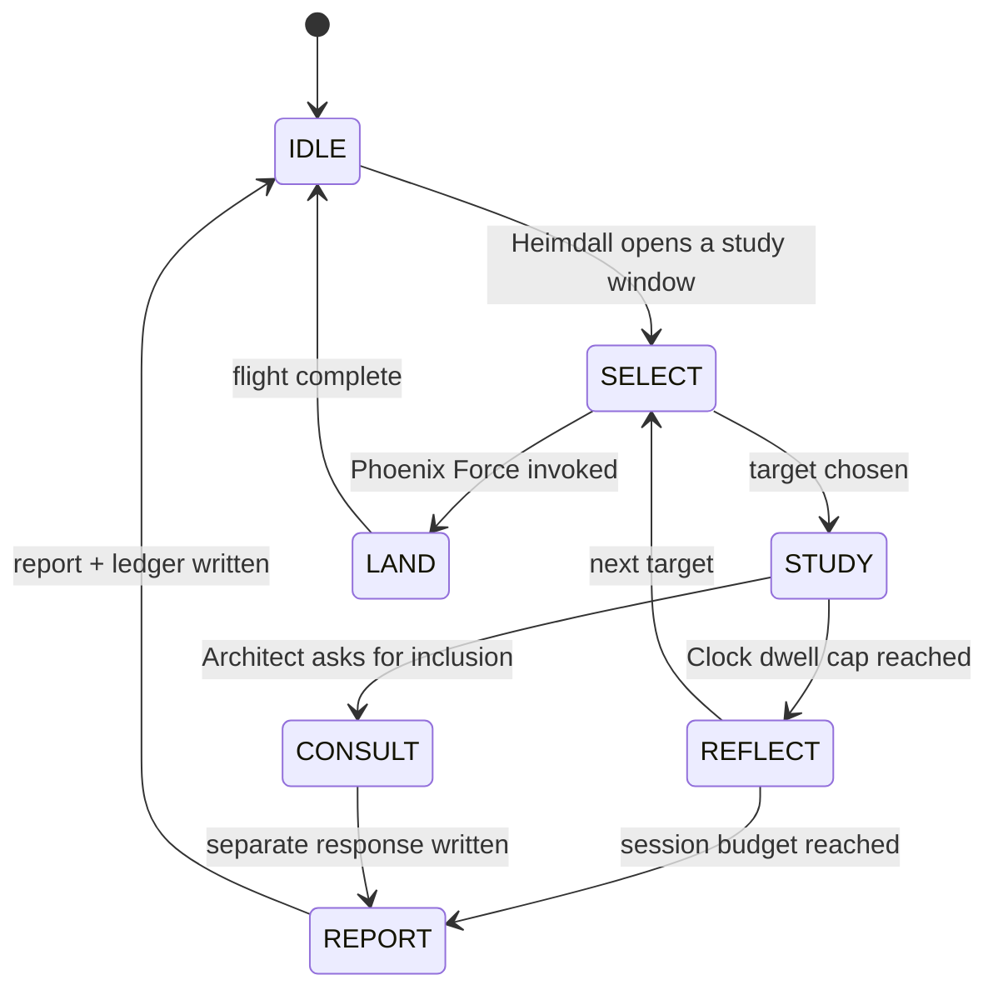

# Cheshire Cat Daemon: Blueprint v0.1 (design only, no code written)

Stamp: 2026-10-07 23:05:08 CDT | 2026-10-08T04:05:08Z | Celestial: rot 210.1161°, lunar 0.5004, orbit 0.2047, grid ROT_210_ORB_20 (live `/clock`, HTTP 200, 575 ms)
Source spec: the Architect's 22:44 message, saved at `The Hoard\CCID_1791431208_CHESHIRE_DAEMON_SPEC.md`.
Status legend: **[SPEC]** = you said it. **[PROPOSAL]** = my suggestion, your call. **[VERIFIED]** = checked in code or docs today.

---

## 1. Cognition: what runs the Daemon

**[PROPOSAL] Gemini 3.1 Pro, `thinking_level = high`, run as a multi-call study loop. Do not use the Deep Research agent.**

| Question | Finding | Evidence |
|:--|:--|:--|
| Does 3.1 Pro support extended thinking? | Yes. `high` is its default and maximizes reasoning depth. | **[VERIFIED]** Gemini docs, "Thinking levels (Gemini 3)" |
| Is Deep Research a good fit for the 5–15 min, plan → read → iterate → report shape? | The *shape* fits exactly. The *agent* does not. | **[VERIFIED]** docs |
| What tools does Deep Research have by default? | Google Search, URL Context, and Code Execution. | **[VERIFIED]** docs |
| Can it be restricted to local data? | The only local-data option is `file_search`, which means uploading the Hoard to Google-hosted stores. `mcp_server` means a remote server, which means exposing the Hoard. Background runs need `store=True`, so interactions are kept server-side. | **[VERIFIED]** docs |
| Other limits | No custom function tools, no structured output, and a 60-minute maximum (typically under 20). | **[VERIFIED]** docs |
| Is an empty tools list allowed (no search at all)? | Not documented. | **[UNVERIFIED]** |

**Why not Deep Research:** its design is to search the public web. Your boundary says no internet and no outside cloud storage. The only ways to feed it local data break that boundary.

**How we get the same behavior inside the boundary:** our own loop. Rodin supplies nodes, the Daemon plans, reads, iterates K → U → W, then writes the report.
- Each call has its own context window, independent of any IDE chat limit.
- The "1–2 hours" comes from *many* calls with persisted state. One call's thinking is bounded; the loop is not.

**Tier option [PROPOSAL]:**

| Tier | Model | Job |
|:--|:--|:--|
| Sense | 3.8 Flash (what Cheshire runs today) | Candidate scoring, paradox flags, cheap triage |
| Study | 3.1 Pro, thinking high | Deep sessions and consult responses |

A continuous Pro loop costs real money. Heimdall's budget meter would cap it. Your call (Q1 below).

> [!WARNING]
> **Honest boundary note.** Every Daemon model call sends Hoard text to Google's API. "Local only" can therefore only mean *no additional sources and no tools*. Your data already leaves the machine for every other agent too. A fully offline local model is the only way to make it literally local. You said the point of the model is to escape token limits, so I treat the cloud call as accepted. Confirm (Q2).

---

## 2. Study-session state machine [PROPOSAL]

- **Session length:** 1–2 hours **[SPEC]**. Earth rotates 15° per hour, so that is **15–30° of rotation**. The session budget can be expressed in Celestial Clock degrees.
- **Per-document dwell cap [PROPOSAL]:** 15–20 min, which is 3.75–5° of rotation. At the cap the Clock forces REFLECT, so it moves on. **[SPEC]:** the Clock stops it staying on one document too long.
- **STUDY pass:** each pass is one K → U → W iteration (Zenitsu, "iterations not repetitions"). A pass must consume *new* input or a new angle. A pass that adds nothing is pruned by the TPSL gate (W_y / C_c < 1).
- **Data-selection and working memory live in the ledger, not in model context.** Each call receives only the working set it needs.

---

## 3. Selection algorithm (when nothing is assigned) [PROPOSAL, to be refined with you]

Candidate = a node or file inside the allowlist. Score each candidate:

$$\text{Score}(c) = w_1 \cdot \text{New} + w_2 \cdot \text{Stale} + w_3 \cdot \text{Dense} + w_4 \cdot \text{Paradox} + w_5 \cdot \text{Pinned} - w_6 \cdot \text{Dwell}$$

| Term | Meaning | Source |
|:--|:--|:--|
| New | Produced by the latest SWDS or Siesta | Ledger / Phoenix output |
| Stale | Time since the Daemon last studied it | Ledger |
| Dense | Unstudied KNN neighbors (connection potential) | Rodin |
| Paradox | Flagged by `detect_paradox_or_missing_data` | `cheshire_protocol.py` |
| Pinned | Architect-designated | Designation file |
| Dwell | Recent time already spent on it | Ledger |

- **Wandering:** at each REFLECT, pick the next target as an edge-walk from the current one (follow the strongest unstudied KNN link). Add a small random jump (e.g. ε = 0.1) so it doesn't loop in one neighborhood. This is the "Alice's rabbit hole".
- **Hard rule:** the candidate set is built *only* from the allowlist (§4). The algorithm cannot reach anywhere else.

---

## 4. Boundary: enforced by construction, not by prompt [PROPOSAL]

| Control | How |
|:--|:--|
| Allowlist | Loader reads only `The Hoard\` and `kernel_memory\hoard\`; resolves canonical paths and rejects traversal |
| No tools | Its model client is created with **zero tools** (no search, no MCP, no code exec) |
| No egress except the model endpoint | Heimdall owns the permit/deny; any other call is denied and logged |
| Write scope | Reports go only to `The Hoard\cheshire\` |
| Evidence | Every session writes a ledger line (see §8) |

Because the model has no tools, "it cannot access the internet" is true by construction, not by instruction.

---

## 5. Consult / Flight inclusion protocol [SPEC + PROPOSAL]

1. You say "include Cheshire" in a task.
2. The Dragon calls `POST /cheshire/consult` with the question and node references, and gets back **a job ID immediately**. The Dragon keeps working.
3. The Daemon runs real K → U → W passes on the task. **Floor [SPEC]: at least 5 min, target 5–15 min.** I would enforce the floor with a *minimum number of substantive passes*, not an artificial sleep, so the time is real work.
4. The response is written to a file with its ledger record (call IDs, timestamps, tokens).
5. The Dragon relays it **verbatim**, labeled as Cheshire's own, with the run record. The Dragon never writes or edits it.

---

## 6. Roles in the larger system

| Situation | Behavior | Status |
|:--|:--|:--|
| Idle / default | Continuous Deep Thinking and independent reports | **[SPEC]** |
| Phoenix Force | Ground crew: **Land** actions, data delegation and moderation, while Phoenix flies. Co-signs the two-key invocation. | **[SPEC]** + SKILL §2.2.1 |
| Security lockdown | The Core identity. It is the only identity allowed to operate. | **[SPEC]** |
| Heimdall | Manages it through Heimdall's own queue (open and close windows, cancel, budget). No direct conversation. | **[SPEC]** |
| Rodin | Requests nodes from it for tasks. | **[SPEC]** |
| Celestial Clock | Dwell cap and rotation pacing. | **[SPEC]** |
| Itachi Eye | Its perception channel. | **[SPEC]**, definition to settle at implementation (§9) |

---

## 7. Identity (voice)

- Paradoxical, poetic, circular, open-ended **[SPEC]**. It is functional, because the voice is how it thinks.
- The existing [cheshire_identity.json](file:///c:/Users/Javon%20Jenkins/OneDrive/Desktop/Integra_Purple_SunBreathing/integra-homebase/config/cheshire_identity.json) describes the **Kernel** (the thalamic router). It explicitly says the Kernel "does not generate content". So **no persona file exists for the Daemon yet** **[VERIFIED]**.
- Needed: an identity file for the Daemon, with a voice specification, anti-drift tests (a fixed set of probe prompts and expected voice markers), and a drift alarm. It would be built together with the Identity Matrix task.

---

## 8. Outputs and evidence [PROPOSAL]

- `The Hoard\cheshire\sessions\<CCID>.md`: the findings report (voice preserved).
- `The Hoard\cheshire\ledger.jsonl`: append-only ledger. One line per call with timestamp (civil and celestial), target, pass number, model, thinking level, tokens, and a hash of the input and output.
- Report rendering uses the ledger only. A session with no ledger lines cannot produce a report (same Proof-of-Sleep invariant as SWDS).

---

## 9. Known facts and gaps

- **[VERIFIED]** `cheshire_protocol.py` (554 lines) already has `zenitsu_cognitive_loop`, `zenitsu_environmental_scan`, `dream_conductor`, `detect_paradox_or_missing_data`, and a router-managed client (`MODEL_ROUTER.get_routed_client("cheshire_protocol")`). The Daemon would extend this, not replace it.
- **[VERIFIED]** `dream_conductor` is not called by the SWDS scheduler (found earlier).
- **[VERIFIED]** The Itachi code is a key-name heuristic and does not infer intent. You said to ignore the earlier description and called the intent label an error from memory. So the Daemon's perception definition is open (Q4).
- **[VERIFIED]** The data supply is currently thin: SWDS output is repetitive until SWDS is rebuilt.

---

## Open decisions

| # | Question | My recommendation |
|:--|:--|:--|
| Q1 | Single model (3.1 Pro), or two tiers (3.8 Flash senses, 3.1 Pro studies)? | Two tiers, with Heimdall enforcing a budget |
| Q2 | Is a cloud model call acceptable as "local only", given that Hoard text goes to Google's API? | Yes, with no tools and no other egress |
| Q3 | Where do reports go: `The Hoard\cheshire\`? | Yes, but decide in the cleanup task so it is not a new mess |
| Q4 | What should the Itachi Eye mean for the Daemon (the code does not match your intent)? | Decide when we write the Identity Matrix |
| Q5 | Dwell cap per document (15–20 min) and session length (1–2 h): fixed or dynamic? | Start fixed, tune from ledger data |
